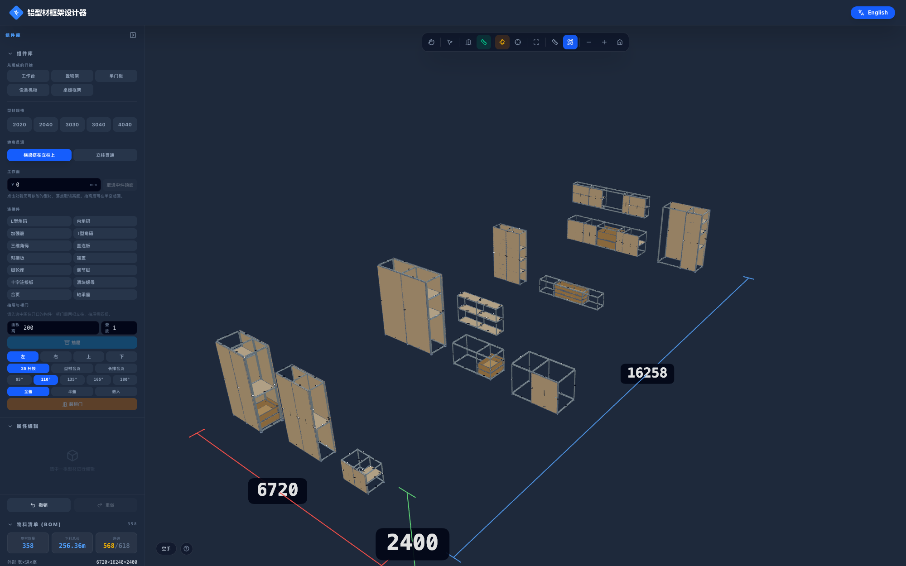

# 铝型材框架设计器

在浏览器里画铝型材框架，画完直接出下料清单。



上图是一套 100㎡ 两室两厅里的**全部柜子**——厨房地柜与吊柜、冰箱蒸烤箱高柜、玄关鞋柜、
电视柜、主次卧衣柜、书桌书架、阳台洗衣柜、餐边柜、浴室柜，一共 12 组。
358 根型材、636 个连接件、38 块板、29 个门与抽屉，下料总长 256.36 m。
**是在浏览器里一根一根点出来的**，不是写进数据里的。

工程文件、物料清单、下料单和 DXF 图纸都在 [`examples/`](examples/) 里，可以直接导入打开。

## 它替你算的事

- **接头修剪**：立柱贯通、横梁切入柱面，中心线长度和**下料长度**是两个数，清单给的是后者
- **干涉检查**：型材、连接件、板件、门与抽屉**四类一起**判定，穿模时标红并指出位置，
  但不阻止你继续画——先摆对，再调整
- **接头可装配性**：端面对接的两根必须有一条相等的边，且对接面共面，角码才贴得平。2020 挂 4040、
  或横梁对着立柱中心线而不是外表面，都会被标出来
- **贴面对齐**：新画的型材落下去会自动横向平移，让接头的两个面共面，优先对齐外侧
- **接头修复**：装不上的接头，一键按"先转、再挪"的顺序试着摆正。每一步都算过分：
  修好一个却弄坏另一个、或者把两根捅穿、或者把构件挪到够不着邻居，都会被退回
- **挠度估算**：选中一根横梁，填上它要承的重量，直接告诉你中间会下沉几毫米、
  相当于跨距的几分之一（已计入型材自重）。下沉超过 1/200 的跨在侧栏统一列出来
- **物料清单**：按规格和下料长度归并型材，按类型和系列归并角码，紧固件由角码推导，板材按尺寸和材质归并
- **原料排料**：按下料长度排 6 m / 4 m 原料，锯口计入，余料续用

## 上手

```bash
npm install
npm run dev          # http://localhost:5173
```

或者用 Docker 跑生产版本：

```bash
docker compose up -d --build    # http://localhost:4174
```

## 怎么用

**没有"模式"。** 在左侧点一个型材规格，它就拿在手里，点击画布即可落点开画；
再点一次同一个规格、或按 `Esc`，就放下了。空手时点击即选中。

| 想做的事 | 怎么做 |
|---|---|
| 画一根型材 | 手持规格 → 点起点 → 沿某个方向移动 → **直接敲数字**定长，回车 |
| 在半空起画 | 挂靠已有型材的端点/表面；或把侧栏的**工作面**抬到目标高度（选中立柱后点「取选中件顶面」）。吊柜就是这么画的 |
| 移动 | 拖动型材；或拖 Gizmo 的彩色箭头沿单轴移动；拖动中**敲数字**可精确定距 |
| 旋转 | 点 Gizmo 的彩色圆弧，一次 90°，Shift 反向；支点可按 `P` 在中心/起点/终点间切换 |
| 拉长缩短 | 空手时拖端面；拖动中敲数字定长 |
| 精确定位 | 属性面板可直接填**起点**和**终点**坐标 |
| 调整截面朝向 | 2040 这类长方形截面，属性面板可一键转 90°（立着放 / 躺着放是两种构件） |
| 改变转角做法 | 侧栏「转角贯通」：横梁搭在立柱上（载荷直传，默认）或立柱贯通 |
| 缩放视图 | 滚轮，或工具栏的 − / + 按钮 |
| 装连接件 | 选一种角码 → 「连接所有接头」一键装满 |
| 装板件 | 选中围住开口的两根立柱 → 「生成板件」（盖在外面）或「嵌入开口」（夹在中间） |
| 装抽屉 / 柜门 | 选中围住开口的立柱 → 填抽屉高度与个数 → 「加抽屉」；或选铰链边与开启角 → 「加柜门」 |
| 修接头 | 侧栏「修复接头」：装不上的接头一次摆正 |
| 量尺寸 | 工具栏的尺子：点两点出距离，再点一次收起 |
| 从模板起步 | 侧栏顶部的模板：工作台、置物架、单门柜、机柜、桌腿框架，尺寸可改 |
| 发给别人看 | 工具栏的分享：整个工程压进一条链接，对方打开即见 |

### 快捷键

| 键 | 作用 |
|---|---|
| `空格` | 在光标处弹出快捷盘（选中时是零件动作，空手时是全局动作） |
| `Ctrl/⌘ + A` / `+ Shift + A` | 全选 / 取消 |
| 双击型材 / 双击空白 | 选中整个连通子装配 / 适配视图 |
| `R` / `Shift + R` | 绕 Y 轴转 ±90° |
| `P` | 切换旋转支点 |
| `L` | 锁定/解锁（锁定件仍可见、仍参与吸附与清单，但不会被移动或删除） |
| `F` / `Shift + F` | 适配视图 / 全屏 |
| `X` `Y` `Z` | 画线时锁定方向 |
| `方向键` / `PgUp` `PgDn` | 微调 5 mm（Shift 为 50） |
| `Ctrl/⌘ + D` / `Z` / `Y` | 复制 / 撤销 / 重做 |
| `Delete` | 删除 |
| 左键拖空白 / 右键拖 / 滚轮 | 旋转视角 / 平移 / 缩放 |
| `Tab` | 光标下有多个零件重叠时，循环切换要选哪一个 |
| `Shift + 拖动` | 自由摆放，不吸附 |

## 支持的零件

**型材**：2020、2040、3030、3040、4040

**连接件**：L 型角码、内角码、加强筋、T 型角码、三维角码、直连板、对接板、端盖、
脚轮座、调节脚、十字连接板、滑块螺母、合页、轴承座

**板材**：密度板、多层板、亚克力、铝板，厚度可填

**构件**：抽屉（滑轨间隙、抽面）、柜门（杯士铰 / 明铰，开启角 95°/110°/165°，全盖 / 半盖 / 嵌入）

## 导出

- **物料清单 CSV**：表头是固定英文，下游工具不依赖界面语言
- **下料单 CSV**：排料结果，每根原料切哪几段、余多少
- **DXF**：三视图带总尺寸，加全部板件的展开下料图
- **工程文件 JSON**：可再导入，版本化（当前 v3，旧文件自动兼容）
- **分享链接**：工程压进 URL，不经过服务器

## 开发

```bash
npm test             # 单元测试（vitest）
npm run test:e2e     # 端到端（Playwright 无头 Chromium）
npm run build
```

**完整功能清单见 [`docs/FEATURES.md`](docs/FEATURES.md)** —— 每项功能是什么、怎么用、在哪个文件里。

设计取舍与踩坑记录见 [`DESIGN.md`](DESIGN.md)，后续计划见 [`docs/ROADMAP.md`](docs/ROADMAP.md)，
参与方式见 [`CONTRIBUTING.md`](CONTRIBUTING.md)。

## 许可

[MIT](LICENSE)。
