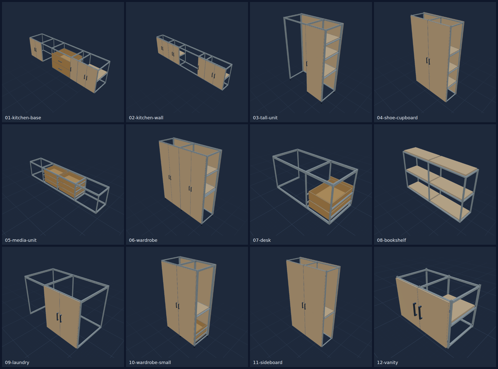

# 铝型材框架设计器

在浏览器中绘制铝型材框架、添加板件和柜门抽屉，并导出物料与下料清单。




[`examples/flat/`](examples/flat/) 包含 12 份独立工程 JSON，涵盖厨房柜、鞋柜、电视柜、衣柜、书桌、书架、洗衣柜、餐边柜和浴室柜。合计 565 根型材、874 个连接件、38 块独立板件和 39 个门或抽屉（27 扇门、12 只抽屉），型材下料总长 368.668 m。门与抽屉内部生成的板件另外计入物料清单。

[`examples/`](examples/) 还提供 L 形橱柜、四门衣柜、书桌、高书架、开放展示架和工具车框架六个示例，以及对应截图和 CSV。示例说明列出了柜体净宽、设备预留和未建模的部件；它们是可编辑的设计样例，不能直接作为完整施工图。

## 功能

- **绘制与编辑**：五种型材规格，轴向绘制、精确长度输入、端面拉伸、移动、旋转、多选、镜像和阵列。
- **接头处理**：按横梁或立柱贯通计算端部修剪，分别保留中心线长度和下料长度；提供贴面对齐、接头检查及修复操作。
- **柜体构件**：独立板件、柜门、抽屉及随面板运动的拉手；支持开合预览。
- **检查**：当前开度下的几何干涉、接头落位、门扇之间的采样运动碰撞、滑轨安装面、层板支承，以及横梁挠度估算。
- **清单与排料**：型材按规格和下料长度汇总，连接件按类型和系列汇总；生成板材尺寸、紧固件建议及原料切割方案。
- **文件**：本地工程保存、导入、分享链接、CSV、DXF 和 STEP 导出。

功能入口和操作细节见 [功能说明](docs/FEATURES.md)。检查采用简化几何和计算参数，适用范围见 [范围与限制](docs/ROADMAP.md)。

## 启动

```bash
npm install
npm run dev
```

开发服务默认地址为 `http://localhost:5173`；端口占用时以终端输出为准。

使用 Docker 启动生产版本：

```bash
docker compose up -d --build
```

访问 `http://localhost:4174`。

## 基本操作

在侧栏选择型材规格后，点击画布确定起点，沿目标方向移动，再点击确定终点；也可以直接输入长度并回车。再次点击已选规格或按 `Esc` 放下构件，进入选择操作。

| 操作 | 方法 |
|---|---|
| 在目标高度起画 | 吸附到已有型材，或设置工作面高度；可取选中立柱的顶面 |
| 锁定绘制方向 | 按 `X`、`Y` 或 `Z` |
| 移动 | 拖动型材，或拖动操作器的彩色箭头；拖动时可输入距离 |
| 拉长、缩短 | 拖动已选中型材的端面；可输入长度 |
| 修改坐标 | 在属性面板填写起点、终点 |
| 旋转 | 点击操作器圆弧，或按 `R` 后指定轴；`Shift` 反向，`P` 切换支点 |
| 调整矩形截面朝向 | 在属性面板旋转截面 90° |
| 修改贯通规则 | 侧栏选择横梁贯通或立柱贯通 |
| 添加连接件 | 选择连接件后点击安装位置，或用「连接所有接头」处理可识别的接头 |
| 添加板件 | 选择围成开口的型材，再选择外盖或嵌入板件 |
| 添加柜门 | 选择前开口两侧立柱，设置铰链和盖合方式后添加；选中门后可在属性中「拆为双开门」 |
| 添加抽屉 | 选择能围出宽度和深度的四根立柱，设置抽面高度和叠放数量后添加 |
| 检查开合 | 使用构件属性中的开度，或在查看模式点击门、抽屉 |
| 检查接头 | 查看侧栏提示；执行「修复接头」后核对剩余问题 |
| 量距 | 使用工具栏尺子，依次指定两个点 |
| 使用示例 | 导入示例 JSON；也可从侧栏模板创建框架 |

绘制时，黄色标出新构件的面，青色标出参考面。有接触面积的对应面显示「贴合」，远处共面显示虚线「对齐」，未满足的目标显示红色。移动时，紫色虚线表示参考面或中心对齐；按住 `Shift` 可自由放置并隐藏这些参考线。

双开门的铰链位于两侧外边，中间留 3mm 缝。抽屉左右分仓需要对应的框架和两侧滑轨安装面；界面中的抽屉数量设置用于上下叠放，不会自动增加分仓型材。

从沿世界 X/Z 轴的横梁上向上画立柱时，可在上表面端边选择「端面齐边」起点；T 形交汇处可选择「接口齐平」。预览显示采用哪根横梁的表面作为参考，确认后按 `Y` 沿竖向绘制。

## 常用快捷键

输入框、下拉框和开度滑块获得焦点时，按键由控件处理。使用画布快捷键前，先结束控件输入并移开焦点；查看模式仅开放选择、视角等操作。

| 快捷键 | 作用 |
|---|---|
| `空格` | 在光标处打开动作菜单 |
| `Ctrl/⌘ + A`、`Ctrl/⌘ + Shift + A` | 全选、取消选择 |
| `Ctrl/⌘ + D` | 复制 |
| `Ctrl/⌘ + Z`、`Ctrl/⌘ + Y` | 撤销、重做 |
| `Delete` | 删除未锁定的选中件 |
| `L` | 锁定、解锁 |
| `F` | 适配选中项；未选择时适配整图 |
| `F11` | 切换全屏 |
| `Tab` | 循环选择光标下重叠的构件 |
| `方向键`、`PgUp`、`PgDn` | 沿轴微调 5 mm；按住 `Shift` 为 50 mm |
| 左键拖空白、右键拖、滚轮 | 旋转视角、平移、缩放 |
| 双击画布 | 向光标下的位置拉近 |
| `Esc` | 取消当前操作或放弃未提交的输入 |

宽度小于 768px 的界面使用底部侧栏；「更多工具」展开其余画布操作。

## 导出与保存

| 格式 | 内容 |
|---|---|
| 物料清单 CSV | 型材下料尺寸、连接件、推导的紧固件、板件及门抽五金；表头为固定英文 |
| 下料单 CSV | 原料切割分配、锯口和余料；超长件单独列出 |
| DXF | 三视图、总尺寸和板件展开图 |
| STEP | 型材、板件、闭合状态的柜门与抽屉板件，以及简化连接件实体 |
| 工程 JSON | 当前文件格式 v6；包含构件、姿态和贯通规则，兼容导入 v1–v5 |
| 分享链接 | 工程数据压缩到 URL 中；打包格式 v4 保存双开门会合边，兼容旧链接 |

导出前应查看「下料前检查」。有待核对项时，文件仍会导出，并显示核对提示。门宽、板厚、滑轨规格、铰链承重、设备安装间隙和实际型材截面仍需按选用的产品核对；显示拉手目前不计入清单和几何碰撞检查。

## 开发与验证

```bash
npm test
npx playwright install chromium
npm run test:e2e
npm run build
```

浏览器测试使用 Playwright。Linux 环境还需安装 Chromium 所需的系统依赖。测试配置、代码结构和部署说明见 [架构与实现](docs/DESIGN.md)。

## 文档与许可

- [功能说明](docs/FEATURES.md)
- [架构与实现](docs/DESIGN.md)
- [范围与限制](docs/ROADMAP.md)
- [示例与尺寸说明](examples/README.md)
- [连接件模型与安装规则](examples/CONNECTORS.md)
- [MIT 许可](LICENSE)
