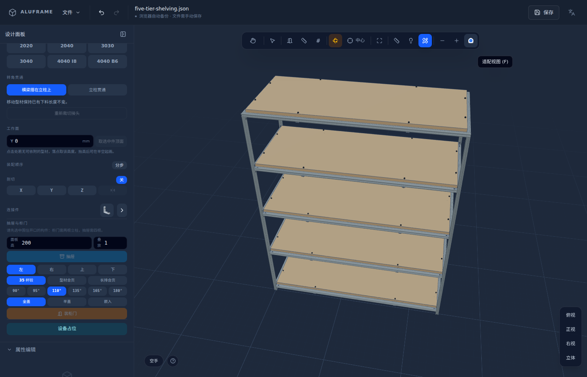

# 铝型材框架设计器

在浏览器中设计铝型材框架、板件、柜门和抽屉，检查连接位置与几何干涉，导出物料和下料清单。

[](docs/demo.mp4)

动图展示环绕和缩放。[完整操作视频](docs/demo.mp4)从空白工程开始，通过界面设置模板尺寸、Shift 多选横梁、逐层嵌入齐平隔板并安装固定件、复制粘贴、安装内角码、拖拽移动、输入旋转角度、撤销、平移视角和保存。成品包含 24 根型材、5 块层板；生成方式见[录制方法](docs/MEDIA.md)。

## 功能

- 绘制六种截面，支持精确长度、端面拉伸、移动、旋转、镜像和阵列。
- 按贯通规则计算接头修剪和下料长度，连接件按型号、槽系和安装孔位选位。
- 添加板件、柜门、上下叠放的抽屉及设备占位，预览开合和关联尺寸变化。
- 检查干涉、连接件安装、板材固定和滑轨安装面，估算横梁挠度。
- 保存工程 JSON，导出 CSV、DXF、STEP 和离线装配说明，生成分享链接。

详细入口见[功能与操作](docs/FEATURES.md)，计算和导出的适用范围见[范围与限制](docs/ROADMAP.md)。

## 启动

```bash
npm ci
npm run dev
```

开发服务默认地址为 `http://localhost:5173`；端口占用时以终端输出为准。

使用 Docker 启动生产版本：

```bash
docker compose up -d --build
```

访问 `http://localhost:4174`。

## 界面与文件



顶栏集中显示文件菜单、撤销重做、工程名、浏览器备份状态和保存。左侧提供组件、所选零件属性、制造检查与清单；画布工具负责观察、测量和选择。

「保存」先打开保存窗口。浏览器支持原生文件选择 API 时，可覆盖当前会话中选定的文件或另存；没有该 API 时下载 JSON 副本，目录由浏览器下载设置决定。写入失败保留原目标并提示错误。浏览器自动备份不等于写回磁盘文件；刷新后需重新选择文件才能恢复写入目标。

| 操作 | 方法 |
|---|---|
| 打开 / 保存 / 另存为 | `Ctrl/⌘ + O` / `Ctrl/⌘ + S` / `Ctrl/⌘ + Shift + S` |
| 加选、取消加选 | `Shift + 单击`；Ctrl/⌘ 不用于加选 |
| 复制 / 粘贴 | `Ctrl/⌘ + C` / `Ctrl/⌘ + V`；同一页面内可跨工程粘贴，刷新清空 |
| 撤销 / 重做 | `Ctrl/⌘ + Z` / `Ctrl/⌘ + Shift + Z` 或 `Ctrl/⌘ + Y` |
| 选择重叠零件 | `Tab` 轮选，或空格菜单打开候选列表 |
| 精确编辑 | 属性面板输入数值；绘制、拉伸、拖动时可键入距离 |
| 检查连接件 | 选择形状后移近节点查看吸附预览；属性中可重新安装或沿槽细调 |
| 观察模型 | 左键拖空白旋转、右键拖平移、滚轮缩放，`F` 适配选择或整图 |

输入框保留原生文本操作；全部快捷键见[快捷键表](docs/FEATURES.md#快捷键)。

## 示例


[示例目录](examples/README.md)提供六份独立家具、十二份柜体工程和十四种连接件的安装展示。每份家具可单独打开、编辑、检查和导出；尺寸、材料数量及未建模的部件列在示例说明中。

这些工程不包含完整施工设计。实际承载、抗倾覆、加工公差及五金选型需要结合实物核对，程序的几何检查不能替代这些工作。

## 开发与验证

```bash
npm test
npx playwright install chromium
npm run build
npm run test:prod
npm run test:e2e
```

浏览器测试使用 Playwright。`test:prod` 在 4175 端口测试已构建的 `dist/`，通过真实 UI 检查创建、编辑、导入、自动保存、恢复和清单下载；`test:e2e` 在 5174 端口运行开发服务的完整 E2E。`npm run test:all` 按上述顺序执行全部检查。Linux 可用 `npx playwright install --with-deps chromium` 安装浏览器和系统依赖。

[CI](.github/workflows/ci.yml) 在推送和 PR 时执行依赖安装、单元测试、生产构建及两类浏览器测试；失败时保留截图和 trace 7 天。测试配置、代码结构和部署说明见 [架构与实现](docs/DESIGN.md)。

## 文档与许可

- [功能说明](docs/FEATURES.md)
- [架构与实现](docs/DESIGN.md)
- [范围与限制](docs/ROADMAP.md)
- [示例与尺寸说明](examples/README.md)
- [连接件模型与安装规则](examples/CONNECTORS.md)
- [交互设计对照](docs/INTERACTION-REVIEW.md)
- [图片与演示制作](docs/MEDIA.md)
- [项目代码的 MIT 许可](LICENSE)

厂家 CAD 派生模型及截面数据保留原来源和权利人标识，不作为本项目原创 MIT 资产重新授权。来源与模型处理说明见[资产说明](src/assets/connectorCad/README.md)。
