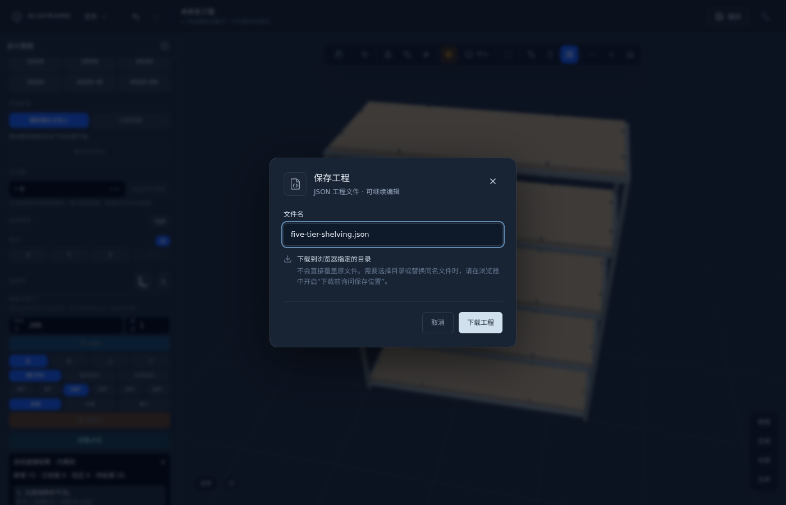

# 功能与操作

本页说明当前界面的操作及结果。实现结构见 [设计文档](DESIGN.md)，检查与导出的边界见 [范围与限制](ROADMAP.md)，可导入工程见 [示例说明](../examples/README.md)。

尺寸单位为毫米，世界坐标的 Y 轴向上。

## 界面与工程文件

固定顶栏提供文件菜单、撤销重做、当前工程名、浏览器备份状态、保存和语言切换。文件菜单包含打开、恢复草稿、保存、另存为、分享及制造文件导出，收起左侧设计面板后仍可操作。左侧按「添加、对象、属性、检查」切换；添加表单按需展开，对象列表支持搜索、类型筛选、定位、隐藏与隔离。隐藏和隔离只影响视图，不删除零件。

未打开文件时显示「未命名工程」。点击「保存」或 Ctrl/⌘ + S 打开保存窗口；Ctrl/⌘ + Shift + S 进入另存为，Ctrl/⌘ + O 打开工程。当前会话已选定原文件时，可在「原文件」和「另存为」间切换；修改文件名会切换到另存为。保存窗口只显示当前方式的确认按钮。文件名随浏览器自动保存恢复；刷新后需重新选择磁盘文件才能写入。

不支持文件选择 API 的浏览器或普通 HTTP 页面（本机 localhost 除外）以「下载工程」保存副本。下载目录与同名文件处理由浏览器控制；需要选择目录时，在浏览器下载设置中开启「下载前询问保存位置」。打开前会校验数据；读取失败、取消另存或写入失败均保留当前工程和原保存目标，写入失败显示错误。

顶栏区分未保存修改和浏览器备份状态。打开其他工程、样例或分享前，未保存的工程可选择「保存后继续」「保留草稿并继续」或取消。草稿按工程分别保存，可在文件菜单恢复；草稿写入失败会阻止切换。打开新工程清空撤销和重做，不会撤回另一个文件的零件。成功写入磁盘后更新保存基线；取消或失败保留未保存标记。下载副本无法确认磁盘完成状态，因此不清除未保存标记。

工程在浏览器本地自动保存，选择集、撤销栈和视图工具状态不随刷新恢复。写入失败或本地存储不可用时，界面持续显示提示，可重试保存或下载当前工程；写入成功后提示解除。本地数据无法读取时，恢复提示提供原始数据下载；点击「开始新工程」会清除该本地工程及恢复副本。

操作日志保留最近 400 条设计改动，支持复制并在本地存储中恢复。日志包含零件、设备和贯通规则变化，开合度不计入设计日志。

## 绘制型材

### 规格与落点

支持六种规格：2020 B6、2040 B6、3030 B8、3040 通用截面、4040 I8、4040 B6。4040 B6 每面有两条槽，槽距 20 mm；与 4040 I8 分开选取。

在侧栏点击规格即可手持型材；点击起点，沿目标方向移动，再点击终点。再次点击同一规格或按 `Esc` 放下。空手时点击零件进行选择。

普通落点可吸附已有端点、型材表面或中心线；空白处落在工作面。端点的屏幕吸附范围为 24px，保持范围为 32px，中心线吸附范围为 18px。未吸附的普通位置按 5mm 网格取整。

从世界 X/Z 轴方向的水平型材上表面靠近端边起画时，可选择「端面齐边」；在水平 T 接头的交汇处可选择「接口齐平」。这些操作分别用支承面确定新立柱底端，用端面或接缝确定侧面位置。

侧栏「工作面」可指定落点高度，也可取选中零件的实际最高点。工作面抬高后，吸附点限于该高度；默认地面仍允许挂靠高处的现有零件。

### 轴向与精确长度

绘制方向根据鼠标移动与世界 X/Y/Z 轴在屏幕上的投影推断；按 `X`、`Y`、`Z` 可指定轴向。

绘制中直接键入数字进入长度输入，回车提交。明确选择贴合面时，输入长度对应实际下料长度；属性面板中的型材长度对应中心线长度。绘制途中缩放、切视图或切换规格会保留起点和已输入长度。

### 面与接头提示

半透明预览显示将要提交的截面朝向、侧移和端部裁切。明确选面时，程序按参考面约束端面落位；向内穿入参考构件或无法满足约束时，会显示原因并阻止提交。

黄色轮廓表示新构件对应面，青色表示已有构件参考面。「起／终」标记及局部面片标出接触位置，顶部显示坐标。接触区域有面积时显示「贴合」，远处共面关系显示虚线「对齐」，未满足的目标面显示红色。

水平型材从地面起画时会按截面高度抬升；立柱可从 y=0 起画。型材拖动和微调也限制底面进入地面以下，属性面板手输坐标保留输入的位置。

### 模板与建议

侧栏提供工作台、置物架、单门柜、设备机柜、桌腿框架五种模板。新建模板保存参数及成员记录，选择成员后可在「属性」再次修改尺寸，保持成员编号，并让已有洞口、滑轨和支承关联随之更新；整次修改可一次撤销。

整组平移或旋转后，包括保存并重新打开后，仍可修改模板参数；原组的位置和朝向保留，已冻结的端面裁切按新尺寸生成。成员数量变化、单根成员修改、删除或锁定时不能更新。工程中有未关联的连接件、板材或门抽屉时会阻止更新；已关联的板材固定件保留宿主、槽位、安装面及沿板位置比例，随尺寸更新，并重新检查安装与干涉；固定件原安装位无效、新位置无法安装、有干涉或锁定件需要移动时，整次更新不生效并提示相关零件。旧工程不自动推断模板记录；复制出来的零件不带模板参数记录。不提供通用约束求解。

工具栏「建议」或 `N` 显示下一根候选型材。候选来自现有构件的重复、平行构件间的连接及层板承托补充；接受前会按当前工程重新检查。点击预览加入，继续点「建议」切换候选，点击空白或按 `Esc` 取消。建议不构成完整柜体或结构方案。

## 选择与编辑

### 选择

| 操作 | 结果 |
|---|---|
| 单击 | 选中型材、连接件、板件、门、抽屉或设备 |
| `Shift` + 单击 | 加选或取消加选；Shift 拖动仍自由移动 |
| 工具栏框选 | 选择框内各类零件 |
| `Ctrl/⌘ + A` / `Ctrl/⌘ + Shift + A` | 全选 / 取消选择 |
| `Tab` / `Shift + Tab` | 向前 / 向后循环选择光标下的重叠候选 |
| 空格菜单「选择连通子装配」 | 从所选型材查找并选中连通型材 |

拾取优先使用真实网格命中，再结合屏幕距离和深度选择候选。连接件按各块实体的投影轮廓计算，轮廓外有 20px 拾取容差；真实遮挡优先，重叠件仍可用 `Tab` 轮选。关闭的门会遮挡框架；可通过画布工具栏的「抽屉与柜门」按钮隐藏它们，查看和选择内部构件。

### 命名分组

在「对象」页选中至少两个零件后可创建命名组；改名或解散组不改变零件。点击组名选中整组，`Shift` 点击加选或取消整组，双击定位。完整复制或粘贴一组会为副本保留独立的组关系；只复制部分成员不带组。删除成员后组保留剩余成员，最后一个成员删除时移除空组；撤销可恢复。分组不建立装配坐标系或运动约束，只读模式不能编辑组。

### 移动、旋转与长度

拖动期间保留实时干涉反馈；连接件安装、滑轨安装面和板材固定检查在松开鼠标后更新。

型材、连接件、板件、门、抽屉和设备可直接拖动，也可拖操作器的彩色箭头沿单轴移动；拖动中键入数字可精确定距。单个连接件拖动以 0.1 mm 定位并吸附附近有效安装位；单轴拖动保持其他轴坐标和朝向，`Shift` 解除吸附。连接件可在侧栏按 0.1 mm 修改位置和调整角度，角接件还可用「重新安装」选择附近的构件组合及安装位置。独立移动连接件会解除其支撑关联，与宿主共同变换时保留关联。未选中的关联部件随其来源更新。

移动吸附时，黄色标出移动面、青色标出参考面，并显示关系和轴坐标；紫色虚线表示其他面或中心的对齐关系。移动中按住 `Shift` 可解除吸附并隐藏参考线。端面拉伸不使用这套移动吸附。

拖动操作器圆弧可连续旋转，默认按 15° 吸附，按住 `Shift` 以 0.1° 精度自由旋转；画布显示当前角度。单击圆弧旋转 90°，按住 `Shift` 反向；属性面板可输入任意旋转角。按 `P` 切换中心、实际起端、实际终端支点，端点支点用于单根型材。多选时围绕所选内容的计算中心旋转。移动、拉伸或旋转过程中按 `Esc` 撤回整次手势，包括精确输入，保留此前的撤销和重做记录；完成的手势对应一次撤销。混选锁定件时，锁定件保持原位并显示数量。

先选中型材，再空手拖它的实际端面可拉长缩短，输入数字可指定实体长度，另一端保持不动。属性面板可编辑中心线的起点、终点、长度和截面朝向；长方形截面可转 90°。

移动、旋转、复制或删除邻件时，现有型材保留当前实体端面和下料长度。「重新裁切接头」会重新计算未锁定件；修改「转角贯通」规则也会重算。这两项操作均可撤销。

### 复制、镜像、阵列与锁定

复制、镜像和阵列支持所有零件和设备，包括混合选择。原件保留，新件获得新 ID 并处于未锁定状态；锁定原件也可作为复制来源。

镜像围绕经过整张工程计算中心、法向沿世界 X/Y/Z 轴的平面生成副本，门的左右铰链边及会合边随镜像调整。三维角码按目标处的可用安装面重新定位；没有可用位置时整次镜像取消。阵列按世界轴、间距和副本数生成，副本数不含原件，上限为 50。

Ctrl/⌘ + C 保存当前所选构件的独立快照，Ctrl/⌘ + V 按 50 mm 间隔连续粘贴；剪贴板在当前页面内保留，打开另一份工程后仍可粘贴；不跨标签页或窗口共享，刷新后清空。型材保持复制时的实际裁切尺寸；同批复制的开口、滑轨、支承关系指向各自的新副本，未一同复制的关系解除。板材固定件单独复制时保留尺寸和原宿主引用，安装状态按副本的实际位置检查。输入框保留原生文本复制粘贴。每次粘贴选中全部副本并对应一次撤销。

`L` 锁定或解锁。锁定件仍参与显示和检查，材料零件仍计入清单，移动、删除及设计属性修改会跳过或拒绝锁定件；开合模拟仍可使用。

选中多块板可一起改尺寸、厚度和材质；多选门或抽屉可一起改尺寸和开度，多选门还可一起改开启角。尺寸连续输入和混合组变换各对应一次撤销。撤销、重做保留仍存在的选中件；撤销历史最多 50 步，刷新后不保留。

## 连接件

目录包括 L 型角码、内角码、加强角码、T 型角码、三维角码、直连板、对接板、端盖、脚轮、调节脚、十字连接板、滑块螺母、合页、轴承座，共 14 种。

侧栏默认仅显示当前连接件的真实模型缩略图；点击箭头展开 14 种形状，选后自动收起，Esc 也可收起并保留画布选择。悬停或键盘聚焦时显示名称和安装说明。选中后，画布实时显示随鼠标移动的连接件，靠近合法位置时磁吸；点击画布放置后继续跟随鼠标。

安装面板列出节点的候选，可按连接构件筛选，点击位置编号预览，再点「放置」；也可用 `Tab` / `Shift + Tab` 轮选。这些选位操作、面板内的放置按钮或「固定节点」会固定当前节点，便于旋转视图检查和连续安装。点击「选择其他节点」恢复鼠标跟随。

两根 2040 B6 的宽安装面垂直对接且槽线对齐时，可分别检查两条槽；不对称内角码的反向姿态可能被真实肩部阻挡。槽 6 内角码仅适配 B6；槽 8 共用型号支持 3030 B8 与 4040 I8，逐臂调整埋深。2040 B6 可连接 4040 B6；与 4040 I8 没有已核验的同一内角码方案。平板角码的每个孔都须落在其宿主槽线上；三维角块安装在三个实际 4040 I8 直切端面之间，并要求三个端孔加工 M8 内螺纹。可用数量由真实型号、孔位、安装面和空间共同决定。

选中面连接件后，「沿槽细调」按相对距离移动，支持 0.1、1、5 mm 步长；画布标出正负方向和双宿主支承区间，区间内仍需逐位置检查干涉。确认后应用，Esc 放弃草稿。越界或干涉时不能提交。角接件和端面配件通过安装位调整。

自动连接完成后，结果列表列出未解决的位置；点击问题可定位接头，并检查同型号候选安装位。

角接件的手动安装、重新安装和自动补齐共用槽线、孔位及干涉检查，冲突位置显示原因。相同孔位的对称姿态视为同一安装位，重复放置不增加零件或撤销记录。自由移动和旋转允许暂时离开槽位，安装问题通过检查提示显示。

「连接所有接头」按所选类型补齐可用位置：角接件枚举端部接头的构件组合、槽线及两侧方向，端盖查找匹配截面的自由直切端，M8 调节脚可直装 3030 B8 / 4040 I8 朝下端，或通过四颗 M6 螺钉和专用加工转接板安装在 4040 B6 朝下端。脚轮用 M8×25 沉头螺钉安装于 3030 B8 / 4040 I8 朝下端。独立且互不干涉的位置可同时安装。先修复距有效安装位不超过 20 mm、同型号同朝向且目标唯一的失位件，再补齐缺件，两步作为一次撤销操作。锁定件和有效件不移动；存在多个目标、超出距离或仍有干涉的零件保留并提示。需要指定表面的零件不自动批量放置。

选中胶合板或 MDF 后，可用「固定所选板材」安装固定件：内嵌水平板用连接片、穿板螺栓和垫套连接下方横梁；贴合型材外面的顶板、背板或侧板用穿板螺栓连接槽螺母。支持 2020/2040/4040 B6、3030 B8 和 4040 I8、6–40 mm 板厚，连接片下方间距为 0–20 mm。B6 / B8 / I8 的板孔分别为 Ø5.5 / Ø6.6 / Ø9，配 M5 / M6 / M8 五金。不改变宿主位置；受阻或无适配位置会提示，完整有效的固定件不重复添加。五金随清单和实体导出；具体安装见[配件说明](CONNECTOR-ACCESSORIES.md#板材固定)。

连接件属性列出参考型号、厂家来源、紧固件、加工和未核验事项。没有对应型号的系列不会按比例创造零件；内角码采用两颗顶丝，无 T 型螺母。展示工程包含 14 种已校验安装。4040 B6 的端盖由四只原厂 2020 B6 盖组合，清单按四只计数。具体来源和配合条件见 [连接件说明](../examples/CONNECTORS.md)。几何校验不验证工具可达性或连接承载。

## 板件、柜门与抽屉

### 板件

选中围住开口的型材，使用「生成板件」或「嵌入开口」生成板件。覆盖板按选中型材的实际外包范围生成；嵌入板结合所选边界及连通框架中的开口边界确定尺寸。水平覆盖板放在横梁上方，水平嵌入板上表面与横梁齐平，需另加固定件；竖向覆盖板放在推断的框架外侧。

支持密度板、多层板、亚克力、铝板，厚度可输入。板件默认保存独立尺寸、位置和朝向；设置洞口关联后随边界更新。

### 柜门

通常选择开口同侧的两根立柱，选择铰链边、类型、覆盖方式和开启角，再点「加柜门」。

铰链边支持左、右、上、下；类型为杯铰、型材合页、长排合页。新建和已有门的界面开启角预设为 90°、95°、110°、135°、165°、180°，工程文件接受大于 0° 且不超过 180° 的数值。

全盖和半盖的门板背面位于框架外平面。嵌入门按水平梁之间的净高度生成，外边各留 3mm，前表面与框架外平面齐平。

选中未锁定的左右铰链单门，在属性中点击「拆为双开门」，按原开口生成左右两扇独立门。开口宽度至少为 120mm，已带会合边的门和上下翻门不支持此操作。铰链位于两侧外边，普通外边保留原盖量，中间会合处留 3mm 缝；拆分不增加中柱。多选时可一起拆分符合条件的门，整次操作可一次撤销。

杯铰和型材合页的演示数量按安装边长度计算：不超过 900mm 为两个、不超过 1600mm 为三个、更长为四个；长排合页为一条。这是模型的数量规则，未根据实际门重、宽度和五金型号选型。

### 抽屉

选择开口四根立柱以确定宽、高、深，填前板高度与个数后点「加抽屉」。前板高度至少 60mm，个数为 1–8；超过开口高度的抽屉不生成。界面新建抽屉使用默认全盖，覆盖方式按钮用于新建柜门。

抽屉属性可设置单侧间隙、箱体板厚、底板厚度、后部间隙、滑轨长度和行程。未设置时，侧间隙为 12.5mm、箱板和底板厚度为 15mm、后部间隙为 20mm；前板厚度固定为 18mm。箱体前端接到前板背面，相邻叠放前板之间留 3mm 缝。

「滑轨规格」可选自定义或 Accuride 3832E。3832E 提供 300–700mm、每档 50mm 的规格子集，长度与料号进入清单，行程按厂家数据读取；例如 450mm 规格行程为 457mm。切换时选择所有选中抽屉都能容纳的最长规格，单侧间隙设为 13mm，可在 12.7–13.5mm 内调整。嵌入抽面预留前板厚度加 3.2mm 的退位；安装高度至少 45.7mm。深度不足或含锁定抽屉时整批不修改。已有文件继续使用原来的自定义尺寸。该选项校核规格尺寸，未生成滑轨实体、安装孔和型材转接件。

底板可加 0–4 根沿深度方向的补强条，宽度和高度可编辑；底板随补强条高度上移。补强条作为板件参与显示、碰撞和导出。

「补齐滑轨支撑」检查所选抽屉两侧，依次尝试 2020、3030、4040 规格，补入可以连接的支撑及角码。已有连续安装面保持不变；找不到前后连接位置或存在碰撞的抽屉不会添加支撑。新增支撑作为一次操作撤销。

尺寸须能容纳完整抽箱，不能只满足前板高度。新建、尺寸编辑、批量操作及导入采用相同校验；无效尺寸不会替换原工程，批量编辑中任一待修改构件不合法时整批拒绝。

个数用于上下叠放，没有自动左右分仓入口。左右两列抽屉需要先设置中间型材及对应的滑轨安装面，再分别选择每个开口生成；抽屉净宽应扣除中间型材厚度。电视柜示例采用左右分仓、半盖抽面。

门和抽屉朝向根据所选开口、连通型材、背板及同一框架内已有构件的固定开口推断。明确选择前后开口时，已有门不覆盖该选择；已有构件的开度不改变朝向证据。这些构件默认保存独立开口尺寸，可在属性中设置洞口关联。

### 跟随洞口边界

同时选中门、抽屉或板件和对应边界型材，在属性中勾选「跟随洞口边界」，逐项选择朝向洞口的左、右、底、顶、前表面。后部可选表面或填写固定深度，确认预览尺寸后点击「应用边界」。

门可设置所占宽度的起止比例；抽屉可设置底部偏移并单独调整高度。板件可选所在面，填写四边留量和向外偏移。关联尺寸随框架变化，需独立修改时先解除关联。补齐滑轨支撑前勾选「新支撑和角码跟随抽屉」，可让本次生成的部件一同更新。

若变化影响锁定部件或产生无效尺寸，整个操作保持原状。删除边界来源后保留上次尺寸并提示失联；可选中来源、重新关联或解除关联。复制完整框架和关联部件时保留副本内部关系；只复制派生部件时解除对原框架的引用。

### 开合与拉手

查看模式下点击门或抽屉可开关，属性滑块可调开度。锁定构件同样可开合；开度变化保留原有撤销、重做记录，不产生操作日志。

拉手随前板显示和运动。默认拉手仅供示意，不生成开孔、清单或碰撞体。在单个门或抽屉的属性中展开「拉手尺寸与开孔」，按实物图纸填写孔距、突出量、方形截面宽厚、孔径和中心 X/Y，再点「应用尺寸」。中心以成品前板中心为零点，突出量从前板外表面量起；左右铰链门为竖向拉手，上下翻门及抽屉为横向拉手。

应用后生成两个通孔，进入孔表、DXF 板件图和 STEP；拉手按用户尺寸进入 BOM，方形截面包络进入 STEP、当前开度干涉和门扇扫掠检查。外形须落在前板内，孔不能越过扣除封边后的毛坯。镜像转换安装位置，拆成双开门时保留距自由边的边距；新门容纳不下拉手或拉手落向铰链一侧时不能拆分。点击「恢复示意」移除制造配置。该配置不对应厂家型号，螺纹和螺钉长度需按实物确定。铰链显示模型不参加碰撞；滑轨和铰链的 BOM 数量由构件参数推算。

## 设备占位

展开「设备占位」，填写名称、本体宽高深及左、右、底、顶、后、前六面的安装预留，点击「添加设备」。设备底面落在工作面上，X/Z 中心取选中内容的计算中心，无选择时为原点。尺寸须为正数，预留量可为零。

设备显示为半透明盒体，线框表示安装预留；本体可选择、移动、旋转、复制、镜像、阵列、锁定和删除。选中后可编辑名称、尺寸、位置和预留量。设备局部 +Z 为前方，六面预留随朝向旋转；仅预留线框不遮挡其他零件的选取。

「下料前检查」分别显示红色的设备实体干涉、橙色的安装预留不足。设备与已建模零件按当前姿态检查，两个设备的本体也会检查；单纯预留区相互重叠不报冲突。设备不进入材料、下料、DXF 或 STEP，名称、尺寸、姿态及预留量随工程和分享链接保存。

建议构件、连接件安装及补齐滑轨支撑会跳过或阻止与设备本体或安装预留冲突的候选。自由绘制、移动和旋转允许保留冲突，并显示检查提示。

## 几何检查与估算

### 接头与干涉

「转角贯通」可选默认横梁贯通或立柱贯通。渲染和清单使用接头裁切后的实体，下料长度与中心线长度分别显示。

程序检查型材、连接件、板件和构件板材的当前几何干涉，标红并显示重叠区域。常规干涉提示允许继续绘制和编辑；明确选面约束不成立时仍会阻止该次新建。

「接头可装配性」显示并选中没有已验证连接方案的接头，包括槽系不兼容的接头；「跨系列接头」列出其中跨系列且没有已验证连接件的位置。槽口同宽或型材外形相同不代表连接件可以互换。角码落位检查核对程序模型中的螺栓点、型材面及槽线。「修复接头」先尝试截面转向，再尝试侧移，只保留改善评分且通过其约束的调整；结果不保证所有接头都能修好。

### 开合检查

门、抽屉与其他零件的干涉按当前开度检查；门扇之间另外采样同步运动及邻门停在关闭、半开、全开时的运动，角度采样间隔不超过 1°。

采样不覆盖所有独立角度组合。位于关闭门后面的可动构件还使用先开外门的顺序假设，程序会略过符合该条件的碰撞对。已配置拉手的包络参与检查，示意拉手不参与。

### 层板承托与滑轨安装面

层板检查识别水平板下方与实际顶面接触的型材，并显示四条边的已识别承托范围。判定按实际面裁剪，要求单个承托面覆盖至少 70% 边长；未识别的边表示需要核对，不能直接解释为没有其他承托方式。

滑轨检查寻找开口两侧的型材或板件安装面，核对方向、位置、高度和深度覆盖。它不推断未建模的安装板、五金孔位、紧固方法或滑轨载重。

### 挠度与下料前检查

选中水平型材可输入载荷。挠度按识别到的实际接触支点，分别估算简支跨中集中载荷和悬挑端集中载荷，并计入型材自重。下沉大于跨距的 1/200 时提示。

截面参数和材料参数是程序内置估算值；计算不包含接头强度、整柜抗倾覆、实际厂商截面差异及装配公差。

侧栏「下料前检查」汇总设备本体和预留冲突、干涉、接头、角码落位、门扇采样、滑轨安装面、挠度和超长下料件，并展示层板承托识别结果。导出文件后会提示待核对项，下载不被阻断，不出现导出确认框。

## 清单与导出

| 格式 | 当前内容 |
|---|---|
| 物料清单 CSV | 按规格和下料长度归并型材；按类型和系列归并连接件，端盖按完整截面区分，4040 B6 调节脚及转接件单独列出；按尺寸、厚度、材质归并独立板件及构件拆出的板材；按构件推算滑轨对数和铰链数量；实体行列出逐件编号 |
| 下料单 CSV | 按原料长度和锯口排料，每根原料一行，列出各段长度、对应编号和余料；超长件列在 `Unsatisfied` 中 |
| 板材排版 CSV | 按材质和厚度分开排版，列出原板号、板件编号、位置、尺寸及旋转状态；超出原板尺寸的板件单列 |
| 板孔 CSV | 输出已安装板材固定件及已配置拉手的通孔，包含板件编号、板内坐标和直径；不推测铰链、滑轨等未建模孔位 |
| DXF | R12 ASCII 的正视、俯视、右视图及总尺寸，包含型材、连接件、独立板件和关闭姿态的构件板材，附编号引线；另附带编号的板材平面下料图 |
| STEP | AP214 简化实体装配，包含型材、连接件、独立板件、闭合位置的构件板材及已配置尺寸的拉手；产品和实例名称使用零件编号 |
| 装配说明 HTML | 概览与分步图、逐件编号及尺寸、材料清单、型材下料表；可离线查看和打印 |
| 工程 JSON | v12，保存设备占位及四类材料零件、洞口及支撑关联、板材固定关联、抽屉结构参数、贯通规则、固定端面、双开门会合边、模板实例、命名分组、板件加工参数及拉手尺寸；兼容导入 v1–v11 |
| 分享链接 | 打包格式 v12，保留设备占位、零件 ID、关联、抽屉结构参数、双开门会合边、端盖截面、内角码逐臂槽系、板材固定关联、模板实例、分组、板件加工参数及拉手尺寸并兼容旧链接；在本地压缩后写入 URL 片段，以关闭姿态载入 |

工具栏「零件编号」可在模型中显示编号；属性面板显示所选件的完整编号，门抽另列内部板件编号。展开物料清单行可查看每个实体的编号，CSV 的 `Part numbers` 列保留相同内容。下料表的编号顺序与切段长度顺序一致。移动、旋转、改尺寸、保存重开和分享不会改变原件编号；复制的新件使用新编号。推算五金没有实体编号。

CSV 表头固定英文，界面支持中文和 English。紧固件按已放置连接件的目录配方推导；对接端和自由端的补件数量列为建议，不能据此认定每个连接点已安装完整五金。

排料可选择 6m、4m 或自定义原料长度，默认每刀锯口 3mm。同根料的余段继续排入后续件；超长件不计入原料根数和利用率。

「检查」页的板材排版可设置原板宽高、边距、锯缝和是否允许旋转 90°，预览每张原板及板件编号。排版按板件长边和面积排序，使用矩形切分，结果不保证最优。独立板件及门抽内部板件可设置局部 X/Y 纹理与四边封边厚度；排版按原板纹理限制旋转，并从成品尺寸中扣除封边得到毛坯尺寸。排版坐标从原板左上角计算；板孔坐标从板材自身平面的左下角计算，均以 mm 为单位。孔表包含已安装板材固定件的实际通孔和已配置拉手的前板通孔，同时给出成品和毛坯坐标，标明通孔是否超出毛坯边缘。DXF 板件图分别标示成品轮廓、毛坯轮廓、纹理方向及四边封边厚度。加工参数随 JSON、分享链接及撤销记录保存；镜像同步转换封边位置。

STEP 在后台线程生成，使用点击导出时的模型和裁切结果；导出期间可继续编辑、缩放或打开其他工程。状态条显示当前任务并可取消，折叠侧栏后仍可操作；重复导出按钮暂时禁用，取消或失败后可重试。文件仍由浏览器下载。

DXF 使用连接件外包轮廓，拉手仅输出已配置的前板安装孔，不输出拉手外形。STEP 采用连接件显示模型的实体形状，合并相邻共面三角面并保留孔环；相同连接件复用局部几何，每件仍有独立名称和装配变换。曲面分面处理，同一零件的多个实体保留独立闭壳，不做布尔合并。STEP 不包含示意拉手、纯视觉标记、螺纹牙型、型材后加工孔及柜门铰链机构。测试检查引用、闭壳及边方向，外部内核检查名称、位置、体积和导出后回读；验证范围见[范围与限制](ROADMAP.md#清单与交换文件)。

装配说明以关闭姿态绘制实体盒轮廓，突出本步新增件，设备以虚线参考显示。图中索引与表格内的完整零件编号对应，点选标记可跳转到材料清单。步骤按几何接触和高度生成，不验证工具可达性、紧固顺序或临时稳定性。HTML 不依赖网络资源，可用浏览器打印为 PDF。

## 视图、测量与设备

- 左键拖空白或中键拖任意位置旋转视角，右键拖平移，滚轮或工具栏 − / + 缩放。
- 双击以光标下的位置为中心拉近；「适配视图」保留观察方向并框住整张工程。按 `F` 则在有选择时框住所选内容，没有选择时框住整图。
- 右下角提供俯视、正视、右视、立体视角。
- 尺子工具点击两点显示距离，再次点工具按钮收起。
- 标注显示整体尺寸和零件尺寸，参与深度遮挡，可开关。「零件编号」独立控制编号标签；重叠或被遮挡的标签会隐藏，完整编号可在属性和清单中查看。
- 「剖切」按 X/Y/Z 平面裁去一侧；被切掉的区域也排除拾取。当前没有封闭剖切面的填充。
- 「装配顺序」按几何接触与高度分批浏览，连接件随关联型材安排，板件和构件随后展示；可选择当前步骤的零件。它不核对工具可达性、紧固顺序或临时稳定性。
- 查看模式收起编辑手柄，禁用设计修改和撤销重做，保留观察、测量和开合模拟。
- 触摸设备支持捏合缩放、双指轻点撤销和长按菜单；触摸板捏合使用浏览器的缩放滚轮事件。
- 768px 以下侧栏折叠为底部入口；常用画布操作保留文字，其余在「更多工具」中。画布高度不足时工具栏内部滚动，标准视角在底部横排，与状态和帮助并列。常用工具栏和标准视角按钮的命中区至少 44px。

## 快捷键

输入框、文本区、下拉框及可编辑文本内的操作优先交给控件；按钮保留原生空格、回车和方向键行为。

顶栏放大镜或 `Ctrl/⌘ + K` 打开命令搜索，支持中文、英文名称和快捷键检索。用方向键选择、回车执行、Esc 关闭。不可用的操作显示原因；执行前再次检查选中件、锁定、查看模式及当前拖动状态。

| 键 | 作用 |
|---|---|
| `Ctrl/⌘ + O` / `Ctrl/⌘ + S` / `Ctrl/⌘ + Shift + S` | 打开 / 保存 / 另存为 |
| `Shift + 单击` | 加选或取消加选；Ctrl/⌘ 不用于加选 |
| `空格` | 在光标处打开快捷菜单；可进入重叠零件候选列表 |
| `Ctrl/⌘ + K` | 打开命令搜索 |
| `Esc` | 取消当前绘制、建议或菜单；属性输入可放弃未提交数字 |
| `Ctrl/⌘ + A` / `Ctrl/⌘ + Shift + A` | 全选 / 取消全选 |
| `Ctrl/⌘ + C` / `Ctrl/⌘ + V` | 复制选中件 / 粘贴副本，每次粘贴对应一次撤销 |
| `Ctrl/⌘ + D` | 立即复制选中件并偏移 |
| `Ctrl/⌘ + Z` | 撤销 |
| `Ctrl/⌘ + Shift + Z` / `Ctrl/⌘ + Y` | 重做 |
| `Delete` | 删除未锁定的选中件 |
| `R` / `Shift + R`，再按 `X`、`Y` 或 `Z` | 绕该轴转 ±90° |
| `P` | 切换旋转支点 |
| `L` | 锁定 / 解锁 |
| `F` / `F11` | 适配选中内容或整图 / 全屏 |
| `V` | 切换编辑 / 查看模式 |
| `X`、`Y`、`Z` | 绘制时锁轴 |
| `方向键` / `PgUp`、`PgDn` | 微调 5mm，`Shift` 时为 50mm |
| `Tab` / `Shift + Tab` | 向前 / 向后轮选重叠件；手持连接件时轮选安装位置 |
| `Shift + 移动拖动` | 解除移动吸附 |
| `N` | 显示下一根建议型材 |
