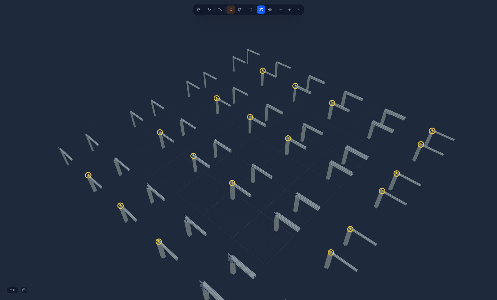

# 连接件与连接方式

打开 `connector-demo.json` 可以自己转着看。图上 15 个格子，每种连接件放在它真正服务的接头形式上，
位置和朝向全部由工具自己的落位代码算出（和你点一下放置走的是同一条路径）。

## 连接方式（接头形式）

| 形式 | 说明 | 用的连接件 |
|---|---|---|
| **L 角接** | 两根型材端头成 90° 相交 | L型角码、内角码、加强筋 |
| **T 接** | 一根的端头顶在另一根的中段 | T型角码、L型角码 |
| **三维角** | 三根在立方体角点相交 | 三维角码 |
| **十字** | 两根同平面交叉，靠面上的板固定 | 十字连接板 |
| **对接延长（外）** | 两根共线接长，外侧加板 | 直连板 |
| **对接延长（内）** | 同上，连接件藏在槽内（图上看不见是正常的） | 对接板 |
| **端面** | 型材自由端 | 端盖 |
| **柱底** | 立柱下端 | 调节脚、脚轮座 |
| **槽内** | 槽里滑动、随处固定 | 滑块螺母 |
| **面装** | 贴在某个面上，位置由人指定 | 合页、轴承座 |

## 零件本身

| 零件 | 形状 | 装在哪 | 拧哪两个面 |
|---|---|---|---|
| **角码 / 角件**（压铸，最常用） | 两片翼板**互相垂直** | 两根围成的**内直角**里 | A 朝向 B 的面 + B 朝向 A 的面，两面**垂直** |
| **连接板 / 连接片** | **平板** | 贴在两根**共面的外侧面**上 | 同一平面内两个面，**共面** |

代码里按落位方式分四类：`angle`（内直角）、`plate`（外侧平板）、`inline`（端面）、`surface`（贴面）。
前两类由工具算位置，后两类放在你指定的点上——哪个面该贴，不是能推断出来的事。

## 能不能连，两条规则同时生效

1. **两根必须有共同边**。2020 与 4040 没有，**任何连接件都不支持这个组合**，静默跳过。
2. **必须存在一条共同槽线**：角码是刚体，两个螺栓在跨接头方向上处于同一位置，那个位置必须在两根上都正好是槽。
   20 面一条槽在正中；40 面两条在 ±10，正中是实心铝。

|  | 2020+2020 | 2020+2040 | 2040+2040 | 2040+4040 | 4040+4040 | 2020+4040 |
|---|---|---|---|---|---|---|
| 四种角码（**齐平**） | ✅ | ✅ | ✅ | ✅ | ✅ | ❌ |
| 四种角码（**居中**） | ✅ | ❌ | ❌ | ❌ | ✅ | ❌ |
