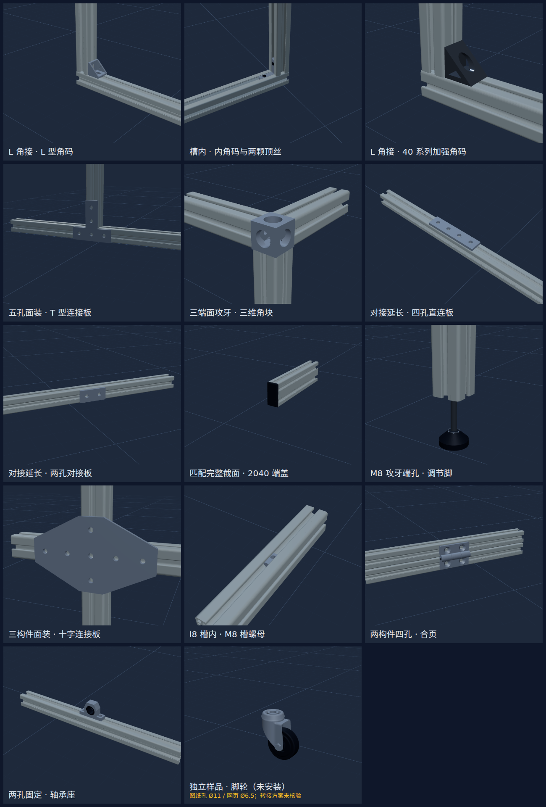

# 连接件模型与安装规则

在侧栏「打开」中载入 [connector-demo.json](connector-demo.json)，可查看 14 种连接件、15 个实例。
L 型角码分别用于 L 角接和 T 接示例。展示工程不参加家具示例的装配检查，模型也未对应具体厂商的产品尺寸。

## 目录

| 连接件 | 模型与用途 |
|---|---|
| L 型角码 | 两个垂直翼板，放在两根型材围成的内直角处 |
| 内角码 | 两条垂直插脚，沿相邻型材的槽布置 |
| 加强筋 | 三角平板，用于角部的外侧平面 |
| T 型角码 | T 形平板，用于端部与中段相接的接头 |
| 三维角码 | 沿三个轴伸出的角件，用于三根正交型材的角点 |
| 直连板 | 外侧连接板，用于共线型材接长 |
| 对接板 | 槽内连接板，用于共线型材接长 |
| 端盖 | 端面盖板和插入段 |
| 脚轮座 | 柱底安装座，带简化轮形显示 |
| 调节脚 | 底盘、支杆和顶板，没有可调行程参数 |
| 十字连接板 | 十字形平板，贴面放置 |
| 滑块螺母 | 槽内螺母示意件 |
| 合页 | 贴面安装的合页示意件 |
| 轴承座 | 底板和轴承示意件，贴面放置 |

连接件按 20、30、40 系列缩放，系列由安装位置附近的型材推断。
螺栓与螺母在 BOM 中按目录配方统计，需根据所选实物连接件确认孔距、螺纹、长度和数量。

## 放置方式

在侧栏选择连接件后，移动鼠标查看预览，点击完成放置。
角码靠近接头时按两根型材计算位置与朝向，预览和放置共用落位计算。
手动重复点击相同类型、系列、位置与姿态的连接件，不会重复添加。

| 落位类别 | 连接件 | 位置计算 |
|---|---|---|
| 内直角 | L 型角码、内角码、三维角码 | 根据相邻型材的朝向、截面和槽线计算角部位置 |
| 外侧平板 | 加强筋、T 型角码 | 查找两根型材的共面外侧面与槽线 |
| 端部 | 端盖 | 使用型材实际裁切或延伸后的端点，并跟随端面朝向和截面转角 |
| 柱底 | 调节脚、脚轮座 | 在附近查找立柱下端，按连接件的模型基准落位 |
| 对接 | 直连板、对接板 | 按指定位置放置，结合附近型材确定朝向 |
| 贴面 | 十字连接板、滑块螺母、合页、轴承座 | 按指定位置与命中面的法向放置 |

「连接所有接头」为当前连接件类型查找接头或自由端。角部候选会检查实际螺栓落面与占位，
端盖使用实际端面，调节脚和脚轮座只处理朝下的端部。贴面件需要手动指定位置。
自动装配可清理当前类型中失去有效安装位置的未锁定件；锁定件和其他类型保留。

抽屉分仓的中柱和两侧安装梁属于型材结构，其连接件与外框一样计入工程和清单。
「加抽屉」不自动生成这些型材或连接件；应按实际接点放置并检查安装面。

手动放置在找不到有效角部位置时仍允许落件，应查看安装检查结果。
仅凭预览出现、零件已加入模型或 BOM 数量满足，不能确认实际安装可行。

## 截面与槽线

自动角部落位首先检查两个截面是否有共同的名义边宽。例如 2020 与 2040 共享 20mm 边，
2040 与 4040 共享 40mm 边；2020 与 4040 在此规则下没有共同边，不生成这类角部座位。
这是本工具的简化角部匹配规则，不是实物连接件的完整兼容目录。

实际落位还取决于型材姿态和槽的位置：

- 模型中 20mm、30mm 宽的面各有一条中心槽，40mm 宽的面有两条槽，距面中心分别为 ±10mm。
- 角件的两条安装臂需分别对准宿主型材的槽线；平板还需要两根型材提供共面的安装面。
- 截面转角及横向偏移会改变可用安装面，同一规格组合不能仅凭“居中”或“齐平”判断是否可装。
- 安装检查按实际裁切后的型材范围验证螺栓落面，三维角码还检查第三条安装臂。

## 检查范围

连接件显示使用简化实体，干涉检测使用近似包围盒。内角码插入槽中的部分不会按完整外包体积
与宿主型材判为干涉；这类处理不能替代实际槽形、插入路径和紧固工具空间的检查。

调节脚的 20 系列显示模型总高为 31mm，包含伸入立柱的部分；它没有行程调节，也不是成品增高量。
端盖、脚轮座、合页等显示模型没有具体厂商规格，不能直接用作加工图。

材料数量、外观和几何检查均不包含连接强度验算。承载、固定方式及采购规格需按实际零件确定。
