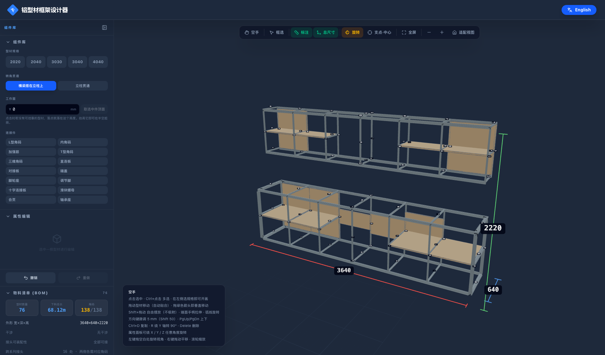

# 示例工程

## kitchen-straight-3600-wall — 一字型厨房（含吊柜、隔层、灶下双抽）

用本工具的界面从零搭的。地柜 3600 × 600、台面 900；**吊柜离地 1500、高 700、进深 350**。
吊柜下方悬空、没有任何可挂靠的东西，是靠把侧栏的**工作面**抬到 1500 再落点画出来的。

| 文件 | 内容 |
|---|---|
| `kitchen-straight-3600-wall.json` | 工程文件，可在侧栏「导入」直接打开 |
| `kitchen-straight-3600-wall-bom.csv` | 物料清单（型材下料 + 角码 + 紧固件 + 板材） |

### 数据

- 外形包围盒 **3640 × 640 × 2220**，型材下料总长 68.12 m，板材 5.08 m²
- 76 根型材：2020 × 58、2040 × 8、4040 × 10
- 138 个 L 型角码（20 系列 126 + 40 系列 12），M5 螺栓/T型螺母各 252，M8 各 24
- 16 块 18mm 密度板：6 块柜门 + 2 块灶下大抽面板 + 4 块地柜隔板 + 4 块吊柜隔板
- **无干涉；所有接头都能装角码**

### 装配约定

**转角处横梁搭在立柱上**（侧栏可切换）。横梁压在立柱顶端，载荷顺着立柱直接往下传；
立柱贯通的话横梁只靠螺栓吊着，柜子高、台面重时不如前者稳。

**尽量外部齐平**：型材落下去时会自动横向平移，让角码要贴的两个面共面，并优先对齐**外侧**面
——所以吊柜下方的进深横撑与柜体**下边沿**齐平，而不是上边沿。

### 为什么这样分规格

端面对接的两根必须**有一条边相等**（角码才有可对齐的边、孔位才对得上），
而且对接面要**共面**（角码才贴得平）。两个条件缺一不可。

| 规格 | 用在哪 |
|---|---|
| **4040** × 10 | 四角主承重柱；以及落在柱子上的进深横撑（同截面，天然共面） |
| **2040** × 8 | 上下纵向主梁 |
| **2020** × 58 | 柜位分隔立柱、中间进深横撑、隔板撑、整个吊柜 |

2020 不直接接 4040：20 和 40 没有共同边。工具会把这类接头标成琥珀色并在侧栏列出。

另有 **16 处跨系列接头**（2040 属 20 系列槽宽 6 / M5，4040 属 40 系列槽宽 8 / M8）。
端面对得齐，只是两侧要各用对应系列的角码与螺母——工具作为采购提示列出，不当作错误。

### 柜位（沿 X，每格 600）

水槽 / 洗碗机 / 抽屉 / **燃气灶（下方两个叠放大抽屉）** / 蒸烤箱 / 边柜。
吊柜与地柜同格，灶上一格留给抽油烟机。
