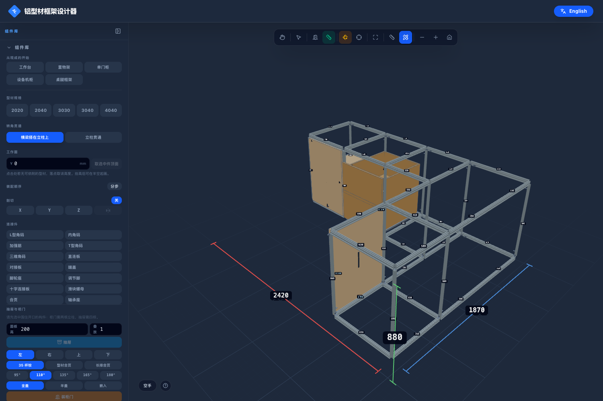
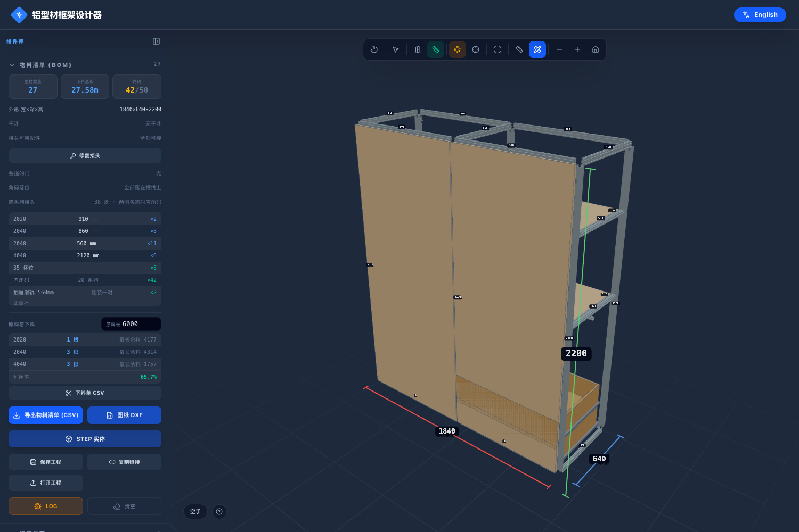
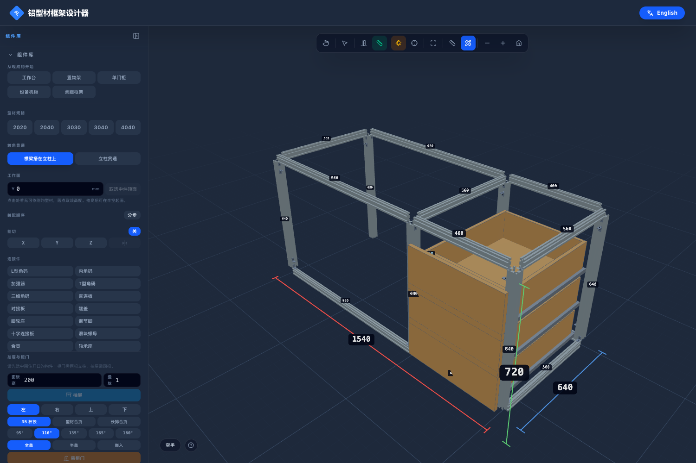
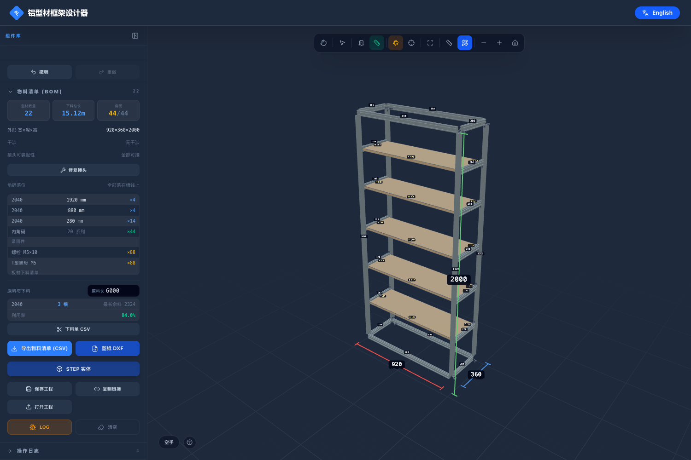
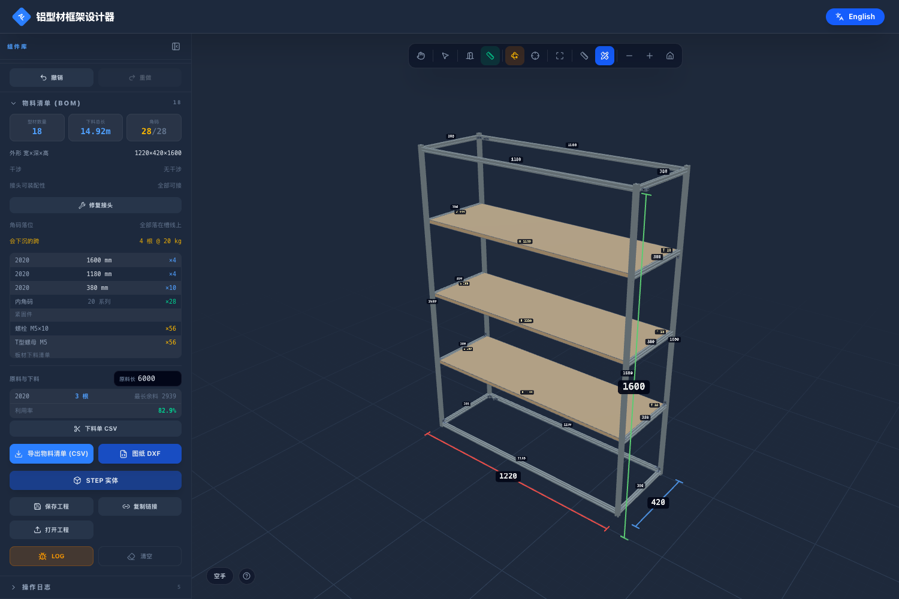
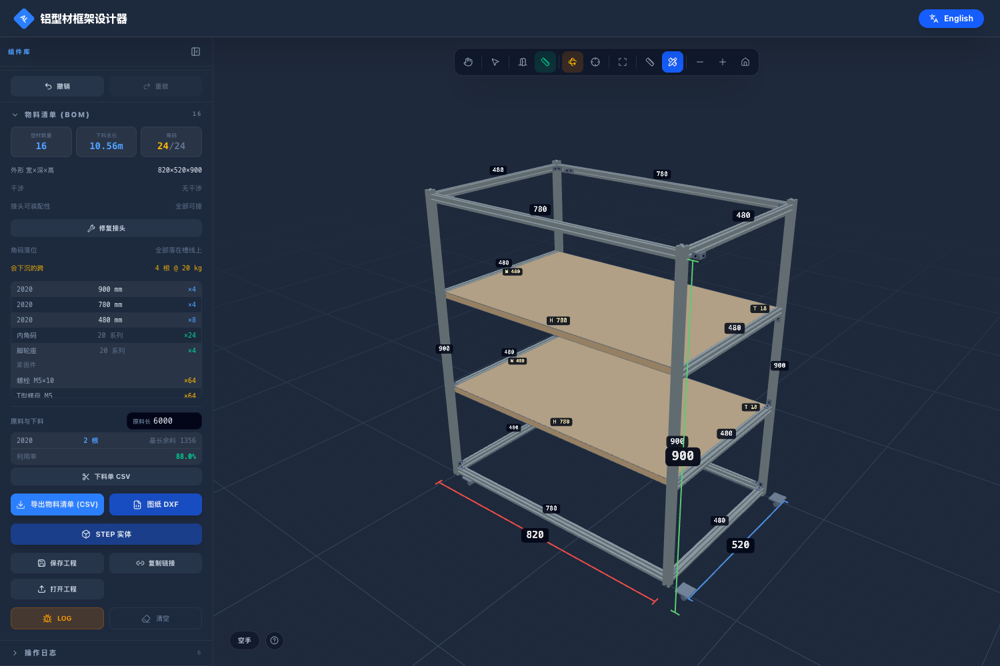

# 示例工程

## 单件家具

六件独立的家具，每件一个工程文件。挑的是**结构上真正不同**的六种，不是同一个盒子换尺寸：
一个转角、一根挂衣杆、一半悬空的桌面、又高又浅的书架、两面通透没有背板可依靠的架子、
以及一台装着脚轮的车。每件都是在浏览器里一根一根点出来的。

| | 外形 W×H×D | 型材 | 连接件 | 板 | 构件 | 下料 |
|---|---|---|---|---|---|---|
| [L 形橱柜](kitchen-l-shaped.png) | 2400×880×1850 | 51（2020×15、2040×36） | 91 内角码 | 1 | 2 门 2 抽 | 33.14 m |
| [双开门衣柜](wardrobe-2-door.png) | 1810×2200×620 | 27（4040×6 立柱） | 42 | 3 | 2 门 2 抽 | 27.58 m |
| [书桌](desk-with-pedestal.png) | 1510×720×620 | 18（4040×6 桌腿） | 29 | 0 | 3 抽 | 11.40 m |
| [高书架](bookcase-tall.png) | 900×1990×330 | 22（全 2040） | 40 | 5 | — | 15.28 m |
| [开放展示架](display-shelf-open.png) | 1200×1600×400 | 18（全 2020） | 28 | 3 | — | 14.92 m |
| [工具车](rolling-cart.png) | 800×900×500 | 16 | 24 内角码 + **4 脚轮座** | 2 | — | 10.56 m |

**六件全部：干涉 0、装不上的接头 0、角码落位错误 0。**
干涉判定包含型材、连接件、板件和构件四类。

每件都有 `.json`（工程文件，侧栏「导入」直接打开）、`-bom.csv`（物料清单）和 `.png`（截图）。

### L 形橱柜

长边 2400 靠墙（z=0），回转边 1850 沿另一面墙，内转角在 (1750, 650)。
长边三档：水槽柜门 / 灶下双抽 / **转角位**；回转边两档：转角位延伸 / 一扇门。

**转角那两档为什么不装门**——这是工具当场报出来、然后按真实做法改的：
门板做到内转角柱，会压住另一条边横梁的端头（工具报 6mm 干涉）。
两侧都试过，两侧都撞。真实厨房里这两档合起来是**一个转角柜**，用转角拉篮或小怪物
从任一侧取用，不是两扇对着开的平开门。

画这一件的过程替工具找出了四个真问题，都已修复并加了回归测试：

1. **门朝哪边开**原来看整个柜体包围盒的中心。L 形的回转边把中心拽到长边背后，
   长边的门全都朝墙开。改成**就地判断**：只看正对着这个开口的构件。
2. **复核层会推翻确证**。"门只能向外开"那层用的是同一个不可靠的全局中心，
   把已经判对的答案又翻了回去。内转角天然歧义（两个方向都是柜体），
   那里只能靠证据：同柜体已挂的门。
3. **已挂的门只能定方向，不能定轴**。L 的两条边朝向不同——回转边的门被按成朝长边，
   而那个方向上两根立柱只隔 20mm，工具直接拒绝，而且是**静默**拒绝。
   现在：共面的两根立柱决定轴，已挂的门只决定正负。
4. **"正对着这个开口"判得太宽**。擦到开口边缘 20mm 就算挡在前面，
   转角处长边的立柱因此把回转边的门带偏。改成必须**跨过开口的中心线**才算正对。

另外它还暴露了一个绘制上的事实：后排柱线原来放在 1800、前排 1750，只隔 50mm；
在能看到整个 L 的视距下一个像素约 3mm，18px 的吸附半径正好能跨过这 50mm，
点立柱时被拉到错误的那条线上。柱线对齐到内转角之后就稳定了——转角处本来也该是一个完整柱位。

### 双开门衣柜

**4040 立柱 + 2040 横梁**，横梁往外推 10mm 与立柱外表面齐平——这是角码能同时贴住两根的前提。
左档长衣区（挂杆 1690）、右档短衣区（挂杆 1090 + 隔板 1150）+ 两只抽屉，顶部通长被褥格。
挂衣杆就是一根横过开口的 2020，这是铝型材相对板式柜唯一不吃亏的地方。

### 书桌

**一半是腿部空间，一半是抽屉柜**，桌面横跨两者。
腿部那一档**没有前底梁**，脚才伸得进去；只在抽屉柜那档做完整底框，
后侧补一根横撑抗扭。4040 桌腿，框架中心线 720，加 18mm 桌面后完成面 748。

### 高书架

900 宽、1990 高、330 深——又高又浅，五层层板。层板托梁全 2040 且 **40 立向**（强轴竖直）：
同样一根料，立着放比躺着放抗弯强三倍以上。

**这一件的顶和底是按你会真的搭的样子做的**，也是现在起步模板的默认：

- **柱子和底框一起落地**。底框侧放（40 竖直）贴着地面，接在柱子之间，
  重量直接落到地上，而不是靠螺栓把底框吊在柱子上。
- **顶框放平，整个盖在柱子顶上**，20 高不是 40，两根长的走满全宽——
  所以顶面是一块完整的平面，四个角不缺口。

原来是"柱子一路通到顶、顶底两圈横梁都嵌在柱子中间"。那样顶面四角各缺一块，
顶板放不平得开四个豁口；顶框还是吊在柱子上的。

这只是常见做法之一，**不是工具强制的**——别的摆法照样画得出来，示例自检里也没有这一条。
改成默认只是因为原来那个不在"常见做法"之列。

### 开放展示架

两面通透，没有背板可以依靠，刚度全靠四角与层板。三层亚克力层板。
这一件是用来看"没有剪力板时框架靠什么站住"的。

### 工具车

唯一一件装**脚轮座**而不是调节脚的。四根立柱底端各一个，
工具知道脚轮座是"站在地上的件"，所以把它座在端面下方而不是埋进立柱里。

---

## flat/ — 100㎡ 两室两厅，12 组柜子，12 张图

整套房子的全部柜体，**在有头浏览器里用点击一根一根画出来的**，不是写进数据里的。
358 根型材、636 个连接件（568 内角码 + 68 调节脚）、38 块板、29 个构件（20 扇门 + 9 只抽屉），
下料总长 **256.36 m**。

一组一张图，文件名前的编号就是下表的顺序。原来是一张图装下全部 12 组，挪一根型材要把
358 根的接头都重算一遍，拖动明显发卡；而实际上谁也不会一次做一整套房子的柜子。

| 柜体 | 宽×深×高 | 内容 |
|---|---|---|
| 厨房地柜 | 3380×650×880 | 水槽 800（下放净水器）/ 洗碗机 630 / 灶 950 / 窄拉篮 300 / 碗柜 700 |
| 厨房吊柜 | 3380×320×780（离地 1550） | 4 扇门；**灶上 950 一档不做柜子，留给油烟机** |
| 冰箱+蒸烤箱高柜 | 1570×650×2300 | 冰箱位 950 不做门；蒸烤箱 620，880/1480 两道承托 |
| 玄关鞋柜 | 1200×380×2000 | 左档 **200 层距 8 层**，右档 450 层距 3 层放靴子 |
| 客厅电视柜 | 2400×400×500 | 中间 1200 三只抽屉，两侧开放走线；横梁全 2040 |
| 主卧衣柜 | 2000×600×2400 | 长衣区挂杆 1700、短衣区挂杆 1100 + 隔板 1150/1800 |
| 次卧书桌 | 1400×600×720 | 腿部 900 / 抽屉 500 |
| 书桌上书架 | 1400×300×800（离地 1300） | 三层，中间加柱分成两跨 |
| 阳台洗衣柜 | 1490×780×980 | 滚筒机位 660，**前底梁拆掉让机器推进去**；右档水槽柜 |
| 次卧衣柜 | 1200×600×2200 | 挂杆 + 隔板 + 两只抽屉 |
| 餐边柜 | 1200×400×2000 | 三道隔板 |
| 卫生间浴室柜 | 800×450×550 | 两扇门 + 一道隔板 |

| 文件 | 柜体 |
|---|---|
| `flat/01-kitchen-base.json` | 厨房地柜 |
| `flat/02-kitchen-wall.json` | 厨房吊柜（离地 1550） |
| `flat/03-tall-unit.json` | 冰箱+蒸烤箱高柜 |
| `flat/04-shoe-cupboard.json` | 玄关鞋柜 |
| `flat/05-media-unit.json` | 客厅电视柜 |
| `flat/06-wardrobe.json` | 主卧衣柜 |
| `flat/07-desk.json` | 次卧书桌 |
| `flat/08-bookshelf.json` | 书桌上书架（离地 1300） |
| `flat/09-laundry.json` | 阳台洗衣柜 |
| `flat/10-wardrobe-small.json` | 次卧衣柜 |
| `flat/11-sideboard.json` | 餐边柜 |
| `flat/12-vanity.json` | 卫生间浴室柜 |

每张图在侧栏「导入」直接打开；物料清单、下料单、DXF 图纸从侧栏「导出」生成。

### 工具自检的结果

- **干涉 0**：型材、连接件、板件、构件**四类全部参与**有向包围盒判定
- **装不上的接头 0**：每个接头都有目录里的件能拧上去
- **角码落位错误 0**：568 个角码全部落在两根型材共有的槽线上
- 618 个对接端，568 个装了角码
- 控制台报错 0

### 它替这套图挑出来的毛病

画的过程本身就是对工具的验收。这些是工具当场报出来、然后改掉的：

- **950 的灶台档用 2020 横梁，25kg 下沉 9.2mm（L/104）** → 凡是超过 700 的跨全改 2040
- **书架 1400 通跨** → 中间加柱，变成两跨 700
- **柜门陷进前立柱**：2020 柜陷 10mm、4040 柜整块 18mm 板埋进去
- **抽屉整体转了 90°**：宽和深对调，面板埋进旁边的立柱
- **背板装在了前脸**，还和柜门打架
- **全盖门共用 20mm 中柱会互压 10mm** → 2020 柜一律改半盖，4040 柜才用全盖
- **调节脚埋在立柱里**，而且先装脚会让三分之一的接头装不上角码

剩下 **12 根**被标成"会看出弯"：书架那三层 700 跨在 25kg 下 L/192，刚过 1/200 的线。
25kg 集中载荷对 700 的层板是偏重的估法（书是均布的，实际约一半），所以保留 2020，
但工具照报不误——这正是它该做的事。

### 明确没做的

零件目录里还没有：踢脚板、挂墙件/防倾倒件、T 槽封条、端盖堵头、台面及垫板、把手、
滑轨型号、层板托、铰链实物件、角码避让缺口。**调节脚这个件有，但模型里只有 20mm 高**，
不是 100mm 可调脚——所以图上的台面高度是按"不加高脚"算的。这些在
[`docs/ROADMAP.md`](../docs/ROADMAP.md) 的 P3「零件库扩展」里。

---

## 一字型厨房去哪了

`kitchen-straight-3600-wall` 删掉了。它是最早的那张示例图，而它有**七处真实缺陷**——
台面横梁比立柱凸出 10mm、柜门贴上去就撞；角码伸进抽屉箱体 19mm；三对全盖门共用 20mm
中柱、每对互压 10mm。这些不是渲染问题，是真的装不上。

它们一直在那儿没人发现，因为当时**干涉检查根本不看板件和构件**——那张图在旧的检查下
是"零干涉"的。检查补全之后它立刻全亮了。

留一张有已知缺陷的图当"示例"，和"示例应该是可施工的"是矛盾的。
厨房这个题目现在由 [L 形橱柜](kitchen-l-shaped.png) 承担，整套住宅由
[flat/](flat/) 里的 12 张图承担，两者都过了全部四项检查。

它那一节里讲的通用道理——角码为什么落在槽线上、为什么 2040 配 4040 而 2020 不配、
抽屉为什么是构件不是六块散板——都在 [`docs/FEATURES.md`](../docs/FEATURES.md) 里，
没有随图一起删掉。

## connector-demo — 连接件外观

十四种连接件各摆一个，用来看它们长什么样、装在型材上什么姿态。
**这不是一个装配**，所以它不参与"可施工"的自检（`src/__tests__/examples.test.ts` 里显式排除）。
