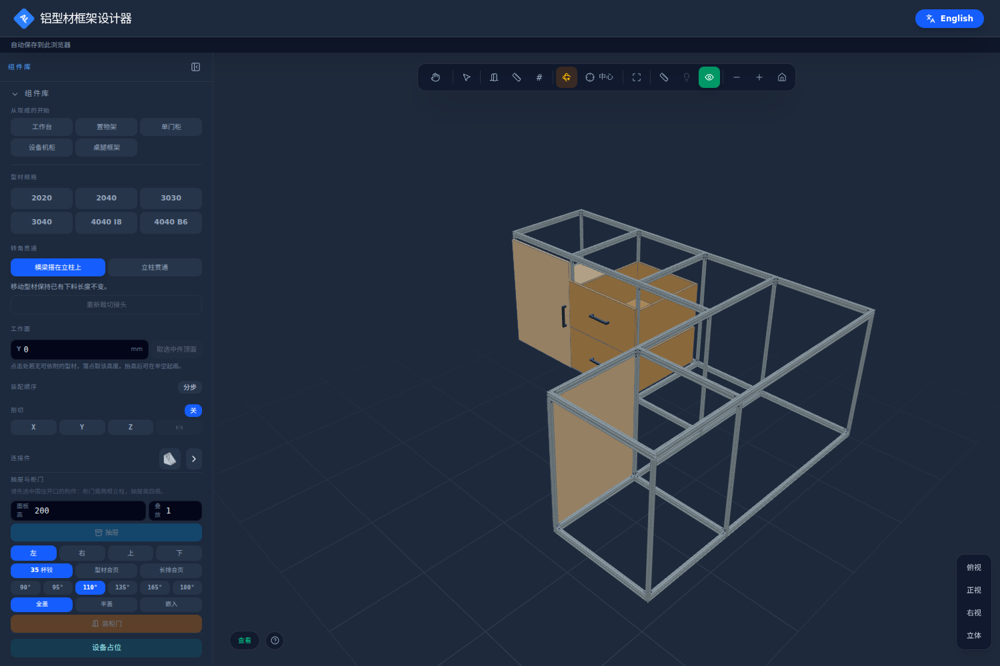
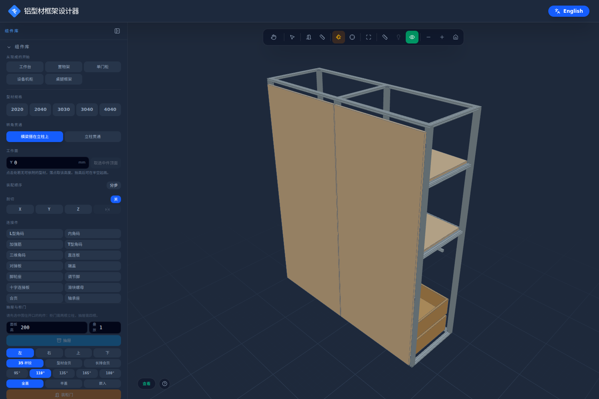
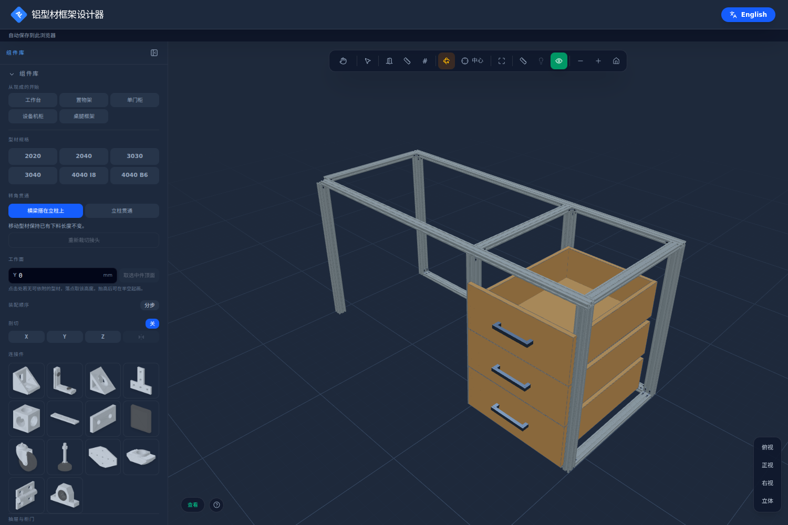
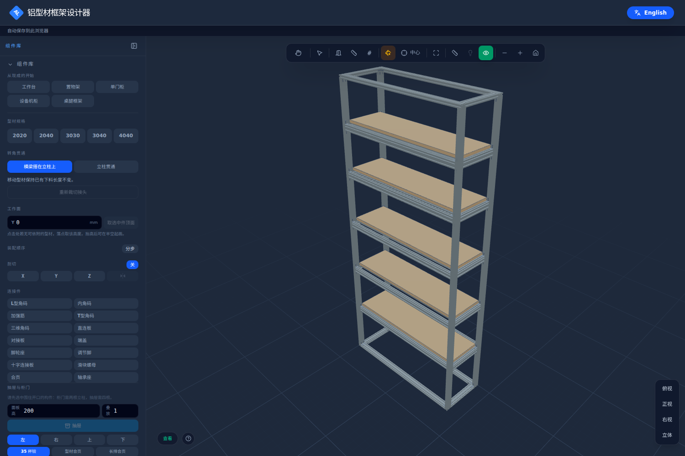
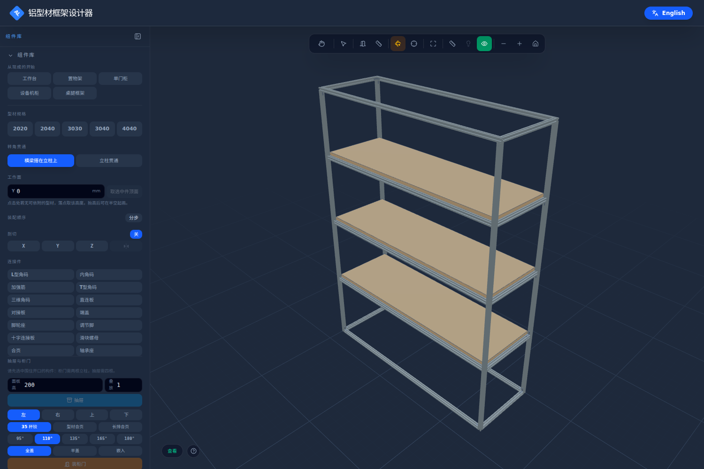
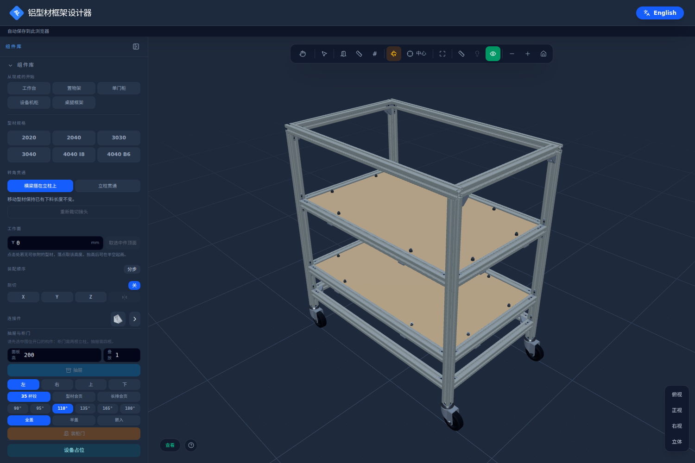

# 示例工程

本目录包含六份独立家具工程、`flat/` 中的十二份柜体工程，以及连接件展示工程。
在侧栏「打开」中载入 JSON，可编辑零件并从「导出」生成物料清单、下料单、DXF、STEP 和带图装配说明 HTML。
PNG 用于预览，不能作为工程文件导入。含双开门的示例使用工程格式 v6，需使用支持 v6 的程序打开；其他示例的旧格式仍可导入。

尺寸单位为毫米。型材外包尺寸按修剪后的型材计算，不含门板、脚、拉手等外伸件。
表中的独立板件数量不含门和抽屉生成的板件；后者另计入物料清单。

## 独立家具

每个示例均有同名 `.json`、`.png` 和 `-bom.csv`。数量与下料长度按横梁贯通规则统计。CSV 的 `Part numbers` 列可与模型、CAD 和装配说明中的零件编号对应；界面物料清单展开行后显示完整编号。

| 家具 | 型材外包 W×H×D | 型材 | 连接件 | 独立板件 | 门与抽屉 | 下料 |
|---|---|---|---|---|---|---|
| [L 形橱柜](kitchen-l-shaped.png) | 2420×880×1870 | 48（2020×21、2040×27） | 68 内角码 | 1 | 2 门 2 抽 | 37.416 m |
| [四门衣柜](wardrobe-2-door.png) | 1800×2200×600 | 47（2020×14、2040×27、4040×6） | 68 内角码 | 3 | 4 门 2 抽 | 42.468 m |
| [书桌](desk-with-pedestal.png) | 1500×720×600 | 16（2040×10、4040×6） | 22 内角码 | 0 | 3 抽 | 11.620 m |
| [高书架](bookcase-tall.png) | 900×2000×320 | 52（2040×32、2020×20） | 86 内角码 | 5 | — | 33.780 m |
| [开放展示架](display-shelf-open.png) | 1200×1600×400 | 36（全 2020） | 52 内角码 | 3 | — | 30.348 m |
| [工具车框架](rolling-cart.png) | 800×900×500 | 28（全 2020） | 40 内角码 | 2 | — | 17.992 m |

### L 形橱柜



工程文件：[kitchen-l-shaped.json](kitchen-l-shaped.json)。长边包括水槽柜门、双抽屉和转角区，
回转边包括转角区与一扇柜门。转角区未安装门或拉篮。两条边的门分别朝 +Z 和 −X。
工程含一块层板，不含台面、水槽和灶具。

### 四门衣柜



工程文件：[wardrobe-2-door.json](wardrobe-2-door.json)。采用 4040 立柱、2040 横梁和 2020 挂杆，
含三块层板、四扇门和两只内嵌抽屉。两根挂杆的轴高分别为 1690mm、1090mm。
两个净宽 840mm 的开口各装一对双开门，每扇门板为 433.5×2130mm，中缝 3mm。
右侧为上下两只抽屉，每只安装开口净宽 840mm，面板宽 834mm，两侧均有滑轨安装梁。
使用抽屉前需同时打开右侧两扇外门；门抽五金仍需按实际尺寸和载荷选型。

### 书桌



工程文件：[desk-with-pedestal.json](desk-with-pedestal.json)。左侧为腿部空间，右侧为三只抽屉。
采用 4040 桌腿和 2040 横梁，腿部空间没有前底梁。型材顶面高度为 720mm。
工程没有桌面板，桌面尺寸、厚度和安装方式需另行设计；不包含桌面的材料或下料数量。

### 高书架



工程文件：[bookcase-tall.json](bookcase-tall.json)。型材外包为 900×2000×320mm，外围采用 2040。
五块层板均为 860×240×18mm，每块下方有四根 2020 承托梁，通过内角码连接至框架。
底框截面的竖向尺寸为 40mm，顶框竖向尺寸为 20mm。工程没有挂墙件或防倾倒件。

### 开放展示架



工程文件：[display-shelf-open.json](display-shelf-open.json)。采用 2020 型材，无背板。
三块密度板层板均为 1160×360×18mm，每块下方有四根 2020 承托梁。
工程未进行侧向稳定和承载计算。

### 工具车框架



工程文件：[rolling-cart.json](rolling-cart.json)。包含框架和两块 760×460×18mm 层板，每层有四边承托。
工程没有脚轮或脚轮座，未计算移动状态下的稳定性。

## flat/：十二份柜体工程


`flat/` 提供十二份独立 JSON，配有上方合照。合计 565 根型材、874 个连接件
（806 内角码、68 调节脚）、38 块独立板件和 39 个构件（27 扇门、12 只抽屉），
型材下料总长为 **368.668 m**。每份工程可单独打开、编辑和导出。

下表列出型材外包尺寸；分区的名义宽度与净宽见下一节。吊柜和书架的放置高度保存在工程坐标中。

| 文件与柜体 | 型材外包 W×H×D | 内容 |
|---|---|---|
| [01 厨房地柜](flat/01-kitchen-base.json) | 3400×880×670 | 水槽双开门、开放洗碗机位、灶下上下两抽、拉篮预留窄门、碗柜双开门 |
| [02 厨房吊柜](flat/02-kitchen-wall.json) | 3400×820×340 | 三对双开门与一扇窄门，共七扇；灶上名义宽 950mm 的一档留空 |
| [03 冰箱+蒸烤箱高柜](flat/03-tall-unit.json) | 1610×2300×690 | 冰箱位无门和前底梁；右档有三块层板及一扇门 |
| [04 玄关鞋柜](flat/04-shoe-cupboard.json) | 1220×2000×400 | 左档八块层板，层距 200mm；右档三块层板，层距 450mm；一块背板 |
| [05 客厅电视柜](flat/05-media-unit.json) | 2420×500×420 | 中间两列六只抽屉，两侧开放；2040 主横梁、2020 侧轨安装梁 |
| [06 主卧衣柜](flat/06-wardrobe.json) | 2040×2400×640 | 两根挂杆、三块层板、一块背板、两对双开门 |
| [07 次卧书桌](flat/07-desk.json) | 1420×720×620 | 腿部与双抽屉分区；未建模桌面 |
| [08 书桌上书架](flat/08-bookshelf.json) | 1420×820×320 | 三层、两跨，共六块层板；未建模挂墙件 |
| [09 阳台洗衣柜](flat/09-laundry.json) | 1510×980×800 | 左侧滚筒机预留位无前底梁，右档水槽预留位有一对双开门 |
| [10 次卧衣柜](flat/10-wardrobe-small.json) | 1240×2200×640 | 挂杆、层板、背板、两扇门、两只内嵌抽屉 |
| [11 餐边柜](flat/11-sideboard.json) | 1220×2000×420 | 三块层板、一块背板、两扇门 |
| [12 浴室柜](flat/12-vanity.json) | 820×550×470 | 两扇门、一块层板；未建模洗手盆和台面 |

### 柜宽、门板与抽屉

分区名义宽度为立柱轴距，净宽为两侧立柱内表面的距离。门板尺寸包含盖量；抽屉净宽指滑轨安装开口，
抽箱外宽比开口小 25mm，即两侧各留 12.5mm。该间隙是模型参数，实际滑轨需按产品安装图匹配。

| flat 柜体 | 分区名义宽 → 型材净宽（mm） | 最宽门板 W×H（mm） | 最宽抽屉净宽 / 面板宽（mm） |
|---|---|---|---|
| 01 厨房地柜 | 800/630/950/300/700 → 780/610/930/280/680；930 档上下两抽 | 394.5×852 | 930 / 942 |
| 02 厨房吊柜 | 800/630/950/300/700 → 780/610/930/280/680；950 档留空 | 394.5×752 | — |
| 03 冰箱+蒸烤箱高柜 | 950/620 → 910/580 | 610×2250 | — |
| 04 鞋柜 | 600/600 → 580/580 | 592×1972 | — |
| 05 电视柜 | 600/1200/600 → 580/1180/580；1180 档抽屉分为 580+20+580 | — | 580 / 592 |
| 06 主卧衣柜 | 1000/1000 → 960/960；每档双开 | 493.5×2350 | — |
| 07 书桌 | 900/500 → 880/480 | — | 480 / 510 |
| 08 书架 | 700/700 → 680/680 | — | — |
| 09 洗衣柜 | 660/830 → 640/810；810 档双开 | 409.5×952 | — |
| 10 次卧衣柜 | 600/600 → 560/560 | 590×2150 | 560 / 554（内嵌） |
| 11 餐边柜 | 600/600 → 580/580 | 592×1972 | — |
| 12 浴室柜 | 400/400 → 380/380 | 392×522 | — |

独立家具中，L 形橱柜最宽门板为 592×812mm，抽屉净宽 580mm；四门衣柜每扇门板为 433.5×2130mm，
抽屉净宽 840mm；书桌抽屉净宽 440mm。高书架、开放展示架和工具车没有门或抽屉。

双开门在每个开口中间留 3mm 缝，外侧按原盖合方式覆盖框架。厨房水槽、碗柜每扇门板宽分别为
394.5mm、344.5mm；吊柜三对门每扇分别为 394.5mm、309.5mm、344.5mm，窄档门板宽 292mm。
厨房地柜使用一列上下两抽，抽面半盖；电视柜使用两列抽屉，半盖抽面跨 20mm 中间型材，左右面板间距为 8mm。
上下相邻的抽面间距为 3mm。各列抽屉两侧均有贯穿深度的实物安装梁，进入型材下料清单。
flat 的电视柜与书桌抽屉统一朝 −Z；厨房地柜的门和抽屉统一朝 +Z。

部分相邻门的最大开启角为 90°，其余上述双开门为 110°：

| 工程 | 最大开启角为 90° 的门 |
|---|---|
| 01 厨房地柜 | 拉篮预留位窄门、碗柜左门 |
| 02 厨房吊柜 | 左柜右门、洗碗机上方柜左门、窄门、最右柜左门 |
| 06 主卧衣柜、独立四门衣柜 | 两个开口之间相邻的两扇门 |

上述角度按工程中的 `swing` 参数模拟。实物需要选择对应的限位铰链或限位件；
限位机构没有建模，也不会自动进入 BOM。更改开启角后应重新检查邻门的运动范围。

以下尺寸需要在五金选型时重点核对：

- 06 主卧衣柜单扇门板为 493.5×2350mm，独立四门衣柜为 433.5×2130mm；高度和实际板重仍需纳入铰链选型。
- 03 高柜门板为 610×2250mm；04、10、11 的门板分别为 592×1972mm、590×2150mm、592×1972mm，需核对所选铰链允许的门宽、门重及安装条件。
- 05 电视柜抽屉净宽 580mm、面板宽 592mm，01 灶下抽屉净宽 930mm、面板宽 942mm；滑轨载重、抽箱底板承托和灶具底部空间仍需按用途确认。
- 独立四门衣柜抽屉净宽 840mm，需同时打开右侧两扇外门；抽拉通道和实际铰链突出量需按实物五金复核。

BOM 中的铰链数量是按门尺寸计算的简化建议，不是承载验算。
[Blum 的铰链数量说明](https://ea.blum.com/en/number-of-hinges/)将重量、尺寸和材质列为选型因素，
其数量表以门宽不超过 600mm 为基础；该条件不能作为所有铰链的统一宽度上限。

### 设备入口

设备位前侧没有底梁，后侧保留底梁。下表仅列型材边界，未扣除角码局部突出、设备门运动、管线、
散热及安装余量。高度从立柱底端 y=0 量到前顶梁底面，不含调节脚增加的高度。

| 设备位 | 两侧型材净宽 | 前入口高度 | 前后立柱之间净深 |
|---|---:|---:|---:|
| 01 洗碗机 | 610mm | 840mm | 630mm |
| 03 冰箱 | 910mm | 2260mm | 610mm |
| 09 滚筒洗衣机 | 640mm | 940mm | 760mm |

01 的洗碗机位前侧开放，没有普通柜门。设备本体及其下翻门、饰面板联动均未建模。
可按选用设备的图纸添加「设备占位」及六面预留，检查本体与周围零件的冲突；占位不进入材料清单。
300mm 档是净宽 280mm 的拉篮预留位，包含普通右铰门，不含拉篮机构。
水槽、灶具、净水器和蒸烤箱也仅预留空间，开孔、散热及检修尺寸需根据所选设备的安装图确定。

## 几何检查与模型范围

示例回归检查包括：

- 型材、连接件、板件和门抽板件之间的包围盒干涉。
- 接头的截面及槽线匹配、已安装角码的螺栓落面，以及同位同姿态重复连接件。
- 水平层板四边的承托范围、承托宽度和顶面高度。
- 抽屉两侧安装面的方向、深度与开口位置。
- 构件关闭、单独完全打开和同步完全打开时的干涉；内嵌抽屉先打开遮挡它的外门。

门间运动检查另以不超过 1° 的角度间隔采样，涵盖邻门关闭、半开、全开和同步运动。
这些检查使用简化几何，不包含所有独立开合角度组合，也不计算结构承载、稳定性或工具可达性。
BOM 的对接端与角码总数用于材料估算，不能单凭总数确定每个接点的实际连接情况。

工程仅包含 JSON 中列出的部件。桌面、台面、侧封板、背板、电器和五金以各文件实际配置为准。
未建模的部件不会进入清单。拉手和连接件为简化模型，具体滑轨、铰链安装座、挂墙件、防倾倒件、
踢脚板及管线等需要另行设计或选型。

调节脚没有可调行程参数。20 系列显示模型总高为 31mm，其中一部分伸入立柱，其他系列按比例缩放；
模型总高不能直接当作柜体增高量。成品高度应结合脚的安装位置及台面等部件计算。
更多功能边界见[范围与限制](../docs/ROADMAP.md)。

## 生成预览和物料清单

在仓库根目录启动开发服务：

```bash
npx vite --port 5174 --strictPort
```

另开终端运行以下命令；需要可用的 Playwright Chromium：

```bash
node scripts/capture-examples.mjs
```

脚本生成六份独立家具的 PNG 与 BOM CSV，以及十二份 flat 工程的合照。

## 连接件展示

[connector-demo.json](connector-demo.json) 包含 14 种连接件、15 个实例，其中 L 型角码用于两个接头示例。
该工程用于查看外观与姿态，不参加家具示例的装配检查。分类、落位规则及限制见[连接件说明](CONNECTORS.md)。
